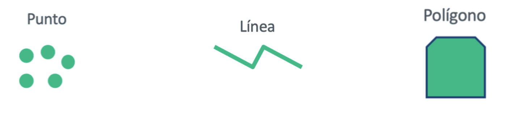
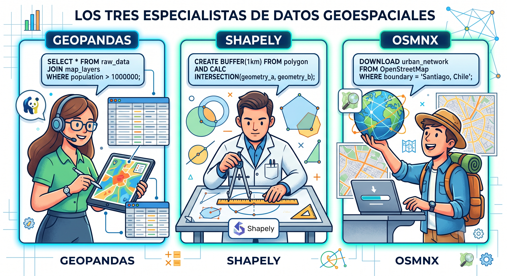
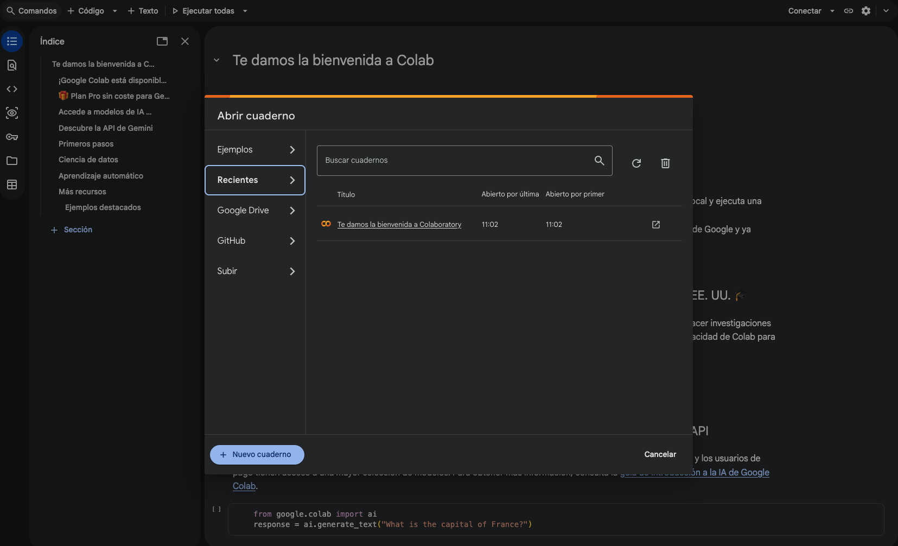
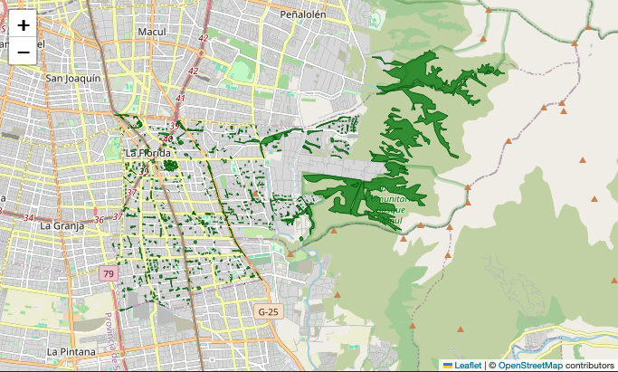

# Ecosistema Python

**Sesión 3.1 · Día 3 · 1,5 horas · Modalidad Meet · Docente: Denis
Berroeta (UAI)**

## Resumen ejecutivo {.unnumbered}

Si la sesión anterior enseñó a "hablar con la máquina", esta sesión
enseña **de qué hablarle cuando el problema es territorial**. El hilo
conductor es simple: *todo lo que pasa, pasa en alguna parte*. Un
reclamo, una luminaria mala, un microbasural o una compostera existen
como evidencia accionable recién cuando sabemos dónde están.

La historia de John Snow lo muestra con fuerza. Mientras la explicación
dominante del cólera en el Soho apuntaba a los "malos aires", Snow puso
las muertes en un mapa y encontró su concentración alrededor de una
bomba de agua. Era la misma epidemia y los mismos datos, pero al
ubicarlos en el espacio apareció una causa que antes no se veía.

Los problemas que enfrentas —dónde falta arbolado, qué barrios están
lejos de un consultorio, cómo se distribuyen los microbasurales— son
problemas *espaciales*, y existe un ecosistema maduro de herramientas
Python especializado en ellos: **GeoPandas** para trabajar con tablas
que tienen geometría [@jordahl_geopandas_2020], **Shapely** para operar
con formas, y **OSMnx** para descargar gratuitamente la cartografía de
OpenStreetMap de cualquier lugar del mundo [@boeing_osmnx_2017].

El giro pedagógico es fundamental: **no aprenderás a programar con
estas bibliotecas**, sino a **conocerlas lo suficiente para nombrarlas
en tus prompts y evaluar lo que producen**. Saber que GeoPandas existe
transforma el prompt vago "haz un análisis de mi comuna" en el prompt
potente "usa GeoPandas para cargar los límites de mi comuna y OSMnx
para descargar sus plazas, y dime cuántas hay por barrio". **El
vocabulario es la palanca.**

Al finalizar la sesión serás capaz de:

1.  **Explicar** qué son los datos espaciales y sus dos componentes:
    atributos (la tabla) y geometría (la forma en el mapa).
2.  **Identificar los tres tipos de geometría** (punto, línea, polígono)
    y asociar fenómenos territoriales a cada uno.
3.  **Describir el rol de cada biblioteca** —GeoPandas, Shapely, OSMnx—
    al nivel necesario para invocarlas en un prompt.
4.  **Obtener datos espaciales reales de tu comuna** mediante vibe
    coding: límites, calles, equipamientos, áreas verdes.
5.  **Producir un primer mapa y una primera tabla-resumen** sin escribir
    código manualmente.
6.  **Auditar rápidamente** si un resultado espacial es plausible,
    leyendo primero la tabla y luego el mapa.
7.  **Distinguir el alcance de esta sesión**: hoy trabajamos con
    vectores; imágenes satelitales, drones y rasters quedan como etapa
    siguiente de la hoja de ruta.
8.  **Reconocer fuentes de datos espaciales abiertas** relevantes para
    Chile.

## Contenidos de la sesión {.unnumbered}

-   Pensar el territorio como datos: atributos + geometría.
-   Caso de apertura: John Snow, el cólera y la bomba de agua.
-   Los tres tipos de geometría: punto, línea, polígono.
-   Formatos de datos espaciales: CSV con coordenadas, GeoJSON,
    Shapefile, KML.
-   El ecosistema: GeoPandas, Shapely y OSMnx como vocabulario de
    prompts.
-   Taller "Mi comuna en datos": vibe coding aplicado.
-   OpenStreetMap con honestidad: potencia, límites y verificación local.
-   Vectores hoy; rasters, satélites y drones como etapa siguiente.
-   Fuentes de datos abiertas para Chile.

## Pensar el territorio como datos

### Todo lo que pasa, pasa en alguna parte

Un **dato espacial** es información que, además de sus atributos, tiene
ubicación y forma en el mapa. La idea se entiende con una planilla
municipal real: el registro de luminarias.

| Componente | Qué es | Ejemplo |
|----|----|----|
| **Atributos** | La tabla: las columnas que describen cada elemento | Potencia, estado, fecha de instalación de la luminaria |
| **Geometría** | La forma y posición en el mapa | El punto donde está instalada |

::: {.callout-tip title="Principio territorial Nº 2"}
**Todo lo que pasa, pasa en alguna parte.** Un dato sin ubicación es una
anécdota; con ubicación, es evidencia accionable. El reclamo, la
luminaria mala o el microbasural recién se pueden priorizar, agrupar y
atacar cuando sabemos dónde están.
:::

::: {.callout-tip title="Analogía: la ficha y el plano"}
Piensa en la ficha clínica de un paciente (atributos) y su dirección
(geometría). Por separado sirven poco para planificar un operativo
sanitario; juntas permiten preguntar "¿dónde se concentran los
pacientes crónicos?". El dato espacial es exactamente eso: la ficha **y**
el plano, unidos.
:::

### Los tres tipos de geometría

| Geometría | Fenómenos territoriales típicos |
|----|----|
| **Punto** | Luminaria, paradero, árbol, punto limpio, compostera, reclamo georreferenciado |
| **Línea** | Ciclovía, red peatonal, eje comercial, ruta de recolección, calle |
| **Polígono** | Barrio, unidad vecinal, comuna, zona inundable, microbasural, bosquete, área verde |

<!-- ::: {.callout-note appearance="simple" icon="false"} -->
<!-- 📷 **IMAGEN PENDIENTE**: Ilustración de un mismo sector urbano de la RM -->
<!-- visto tres veces: una capa de puntos (luminarias/paraderos), una de -->
<!-- líneas (calles/ciclovías) y una de polígonos (manzanas/plazas), con -->
<!-- rótulos "Punto", "Línea", "Polígono". Idealmente las tres capas -->
<!-- superpuestas en una cuarta vista. -->
<!-- ::: -->

{fig-align="center" width="300"}

El juego de clasificación de la sesión: el docente nombra fenómenos
urbanos (compostera comunitaria de Peñalolén, ruta de recolección del
GORE, microbasural de La Florida, red peatonal de WOM) y la sala los
clasifica como punto, línea o polígono. No hay trampa: casi todo el
territorio cabe en estas tres formas.

La duda también enseña. Un microbasural puede representarse como punto
si queremos contarlo, o como polígono si queremos medir su superficie.
La forma depende de la pregunta.

### Formatos que te llegarán en la vida real

Solo para reconocerlos de nombre: planilla con coordenadas (**CSV**),
**GeoJSON**, **Shapefile**, **KML**.

| Formato | Cómo reconocerlo |
|----|----|
| **CSV** | Una planilla con columnas de coordenadas; probablemente ya lo tienes |
| **GeoJSON** | Estándar común en la web y en portales de datos abiertos |
| **Shapefile** | El veterano de los SIG; suele venir como un `.zip` con varios archivos que funcionan como una sola capa |
| **KML** | Formato habitual de Google Earth y My Maps |

::: callout-tip
Mensaje clave: **no importa el formato; la IA sabe abrirlos todos si le
dices cuál es**. Basta con escribir "tengo un Shapefile con las
manzanas de mi comuna" y la IA se encarga del resto.
:::

## El ecosistema: GeoPandas, Shapely y OSMnx

### Tres especialistas de un equipo

| Biblioteca | Rol en el equipo | Qué hace |
|----|----|----|
| **GeoPandas** | El analista | Maneja la tabla con geometría: filtra, agrupa, cuenta, mapea |
| **Shapely** | El geómetra | Crea y opera formas: distancias, áreas, zonas de influencia |
| **OSMnx** | El cartógrafo | Trae gratis desde OpenStreetMap calles, plazas, edificios y límites de cualquier comuna |

{fig-align="center" width="600"}

### Por qué los nombres mejoran los prompts

Comparación en vivo de la sesión:

> **Prompt vago**: *"Haz un análisis de mi comuna."*
>
> **Prompt potente**: *"Usa GeoPandas para cargar los límites de la
> comuna de La Florida y OSMnx para descargar sus plazas, y dime cuántas
> hay y qué superficie total suman."*

El primero produce algo genérico e impredecible; el segundo, un
resultado concreto y verificable. Conocer los nombres de las
herramientas no te convierte en programador: te convierte en un
director que da instrucciones precisas.

::: {.callout-tip title="Analogía: la ferretería"}
Puedes pedir "algo para colgar un cuadro" y recibir cualquier cosa, o
pedir "un tarugo de 6 mm y un tornillo de 4x40" y recibir exactamente
lo que necesitas. No necesitas saber fabricar tornillos: solo conocer
sus nombres.
:::

### OpenStreetMap, con honestidad

OSMnx trabaja sobre OpenStreetMap, que funciona como una Wikipedia de
los mapas: cualquiera puede editar, la comunidad corrige, y la calidad
depende de cuánta comunidad hay mapeando cada territorio. Por eso el
centro de Santiago puede estar muy completo mientras una zona rural o
periurbana aparece a medias.

Esto no invalida el dato; define cómo usarlo. OpenStreetMap sirve para
empezar rápido, explorar y producir una primera versión del diagnóstico.
La verificación final la hacen los equipos con conocimiento local: si
el mapa dice que tu comuna tiene 3 plazas y tú conoces 15, el dato está
incompleto. No falló tu memoria; apareció una tarea de auditoría.

::: {.callout-note}
**OSM es tan bueno como su comunidad local.** Si una comuna está poco
mapeada, eso también puede convertirse en oportunidad: completar el
mapa mediante crowdsourcing, mapeo comunitario o revisión con actores
territoriales.
:::

El caso de Puerto Príncipe después del terremoto de Haití en 2010 ayuda
a entender la potencia del enfoque. Cuando no existía cartografía
digital utilizable de los barrios más golpeados, voluntarios trazaron
calles, campamentos y hospitales en OpenStreetMap a partir de imágenes
satelitales. El mapa que permitió orientar ayuda lo construyó una
comunidad distribuida.

### Dónde corre esto

-   **Notebook de Google Colab pre-preparado** del curso: cero
    instalación, se abre en el navegador y se ejecuta celda por celda,
    con comentarios en español llano.
    
    {fig-align="center" width="600"}
-   **Antigravity**: para quienes ya lo tienen operativo de la sesión
    2.2.

## Actividades

### Taller: mi comuna en datos (35 min)

El docente modela cada paso con la comuna ancla (La Florida) y tú
replicas con la tuya. Secuencia de prompts:

1.  > *"Descarga con OSMnx el límite de la comuna de [X] y muéstralo en
    > un mapa."*
2.  > *"Descarga las plazas y áreas verdes de la comuna y dibújalas
    > sobre el mapa anterior."*
3.  > *"Cuenta cuántas áreas verdes hay y calcula la superficie total en
    > hectáreas."*
4.  > *"Haz un mapa interactivo donde al pasar el mouse se vea el nombre
    > de cada área verde."*
5.  **Iteración libre**: adapta la secuencia al equipamiento pertinente
    a tu problemática (consultorios, colegios, paraderos, ferias,
    puntos limpios).

Prompt compacto para equipos:

> *"Descarga con OSMnx el límite de la comuna de [TU COMUNA] y sus
> [plazas / consultorios / puntos limpios]; muéstralos en un mapa y dame
> una tabla resumen."*

Para proyectos a escala regional, el notebook incluye una variante para
trabajar con región completa. Para equipos de residuos, los puntos
limpios suelen aparecer en OpenStreetMap como `amenity=recycling`, lo
que permite una primera exploración directa.

Si OSMnx falla o la red se cae, el curso mantiene un notebook de
respaldo con datos ya descargados de las comunas de los equipos. El
objetivo pedagógico no es pelearse con la instalación, sino aprender a
dirigir, leer y auditar el flujo espacial.

{fig-align="center" width="600"}

<!-- ::: {.callout-note appearance="simple" icon="false"} -->
<!-- 📷 **IMAGEN PENDIENTE**: Secuencia de 4 capturas del taller con la -->
<!-- comuna de La Florida: (1) límite comunal solo, (2) límite + áreas verdes, -->
<!-- (3) tabla-resumen con conteo y hectáreas, (4) mapa interactivo con -->
<!-- tooltip mostrando el nombre de un área verde. -->
<!-- ::: -->

Durante el taller se instalan dos hábitos permanentes:

-   **Leer la tabla antes que el mapa**: ¿los números son plausibles?
-   **Guardar los prompts que funcionaron**: son tu prompt-book
    personal.

::: {.callout-important title="Primero la tabla, después el mapa"}
Antes de mirar si el mapa "se ve bonito", revisa si los números tienen
sentido. Si la tabla dice que tu comuna tiene 47 plazas y tú sabes que
hay cerca de 20, detectaste un problema. Esa es la regla de trabajo:
probar siempre con un caso cuyo resultado aproximado ya conoces.
:::

### Ejercicios de extensión

Para quienes terminan rápido: comparar dos comunas con la misma
secuencia (¿cuál tiene más áreas verdes por habitante?).

### Tarea puente (20 min, opcional)

Replica la secuencia con un segundo tipo de equipamiento relevante para
la problemática de tu equipo y guarda el mapa resultante.

## Pregunta frecuente: ¿y satélites, drones y rasters?

Varios proyectos territoriales trabajan con imágenes satelitales,
drones, riesgo de aluviones, detección de microbasurales o sensores
remotos. Esa es la otra mitad del mundo espacial: los **rasters**. A
diferencia de los vectores, que representan puntos, líneas y polígonos,
un raster representa el territorio como una grilla de celdas o píxeles.

La respuesta honesta para esta sesión es: **hoy vectores; la capa
satelital queda como etapa siguiente de la hoja de ruta**. Lo que
aprendes aquí no se pierde: límites comunales, calles, áreas verdes,
equipamientos y buffers son la base sobre la que después se integran
imágenes, drones o modelos más especializados.

## Fuentes de datos para el mundo real

Panorama de fuentes abiertas chilenas:

| Fuente | Qué tiene | Facilidad de uso con IA |
|----|----|----|
| **OpenStreetMap** (vía OSMnx) | Calles, equipamientos, áreas verdes, límites de todo el mundo | Muy alta: un prompt basta |
| **IDE Chile** | Cartografía oficial del Estado | Media: requiere descargar capas |
| **datos.gob.cl** | Datos públicos de todos los servicios | Media: calidad variable |
| **INE / Censo** | Población por manzana y zona censal; capa clave para la sesión 3.2 | Media: formatos técnicos, pero la IA los abre |
| **SUBDERE / BCN** | Límites oficiales y estadísticas comunales para validar cifras | Media |
| **Transparencia municipal** | Información administrativa y territorial comunal | Variable |

::: callout-warning
**Honestidad sobre OpenStreetMap**: es libre y global, pero su
completitud varía por comuna. La verificación rápida es contra tu
conocimiento local: **tú eres el experto en tu territorio**. Si el mapa
dice que tu comuna tiene 3 plazas y tú conoces 15, el dato está
incompleto, no tu memoria.
:::

## Resumen

-   Un dato espacial = **atributos** (la tabla) + **geometría** (la
    forma en el mapa). Todo fenómeno territorial cabe en tres
    geometrías: punto, línea o polígono.
-   No necesitas dominar GeoPandas, Shapely ni OSMnx: necesitas
    **nombrarlas en tus prompts**. El vocabulario es la palanca.
-   OSMnx te da acceso gratuito a la cartografía de cualquier comuna del
    mundo; su completitud se valida contra tu conocimiento local.
-   Hábitos del oficio: leer la tabla antes que el mapa, y guardar los
    prompts que funcionaron.
-   Hoy trabajamos con vectores; rasters, imágenes satelitales y drones
    pueden declararse como etapa siguiente de la hoja de ruta.
-   La próxima sesión: ya sabes traer capas; aprenderemos a **cruzarlas**,
    medir buffers y responder preguntas como "¿cuántas personas viven a
    más de 500 metros de un área verde?".

## Recursos

-   **Notebook Colab "Mi comuna en datos"**: pre-cargado con la
    secuencia del taller, celdas comentadas en español llano.
-   **Notebook de respaldo con datos pre-descargados** de las comunas de
    los participantes (ante fallas de red/OSM).
-   **Prompt-book de la sesión**: los 5 prompts de la secuencia + 5
    variantes por tipo de equipamiento.
-   **Ficha "Ecosistema espacial en una página"**: qué es y qué hace
    cada biblioteca, con la frase de prompt típica para invocarla.
-   **Directorio comentado de fuentes de datos abiertas de Chile**:
    contenido, formato, dificultad y prompt de ejemplo para cada una.
-   Galería de 3–4 ejemplos inspiradores de análisis espacial municipal
    hechos con estas herramientas.
