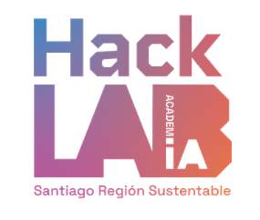
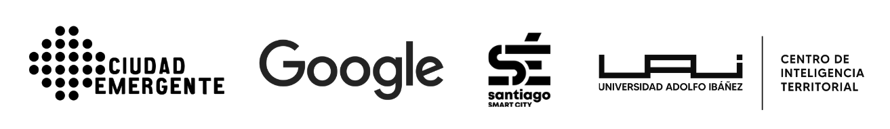

---
editor:
  markdown:
    wrap: 72
---

# Introducción {.unnumbered}

{fig-align="center" width="300"}

{fig-align="center" width="850"}


## El programa

**AcademIA HackLab: Santiago Región Sustentable** es un programa de
formación aplicada cuyo objetivo es **acelerar y escalar la acción
climática en la Región Metropolitana de Santiago**, utilizando la
Inteligencia Artificial (IA) y la ciencia ciudadana para la
transformación sustentable de espacios públicos, barrios y comunidades.

El curso convoca a **80 participantes organizados en 20 equipos de 4
personas**, provenientes principalmente del sector público (municipios,
gobierno regional, servicios), además de organizaciones de la sociedad
civil y el sector privado. Los equipos trabajan sobre **problemáticas
territoriales reales de sus propias comunas**, culminando con la
presentación de una hoja de ruta de aplicación de IA en sus
organizaciones.

Este documento reúne los contenidos de las **siete sesiones a cargo de
Denis Berroeta (UAI)**, que recorren el camino completo desde aprender a
"hablar con la máquina" hasta producir evidencia territorial integrada
para la toma de decisiones.

## Docente

**Profesor:** 

**Contacto:**  · 

Denis Berroeta es magíster en Inteligencia Artificial por la Universidad
Adolfo Ibáñez, máster en Data Science y actualmente cursa un PhD en Data
Science. Se desempeña como  del
 de la .

Su trayectoria se ha desarrollado en el modelamiento y análisis de datos
espaciales, participando en proyectos de investigación públicos y
privados vinculados al . En ese rol ha diseñado,
coordinado y gestionado la implementación de metodologías de análisis de datos
territoriales para apoyar procesos de diagnóstico, planificación y toma
de decisiones.

Cuenta además con experiencia docente en geoestadística, análisis
criminal, análisis de imágenes satelitales para el monitoreo ambiental y
ciencia de datos.

## ¿Para quién es este libro?

El diseño de estos contenidos asume explícitamente el siguiente perfil
de participante:

-   **Profesionales del mundo público**: planificadores, gestores
    territoriales, encargados de medio ambiente, SECPLA, DIDECO,
    profesionales de participación ciudadana.
-   **Sin conocimientos previos de programación**: nunca han escrito
    código ni se les pedirá aprender a programar.
-   **Sin formación en estadística ni en inteligencia artificial**: los
    conceptos técnicos se introducen solo en la medida en que habilitan
    la toma de decisiones.
-   **Con profundo conocimiento del territorio y de sus problemáticas**:
    este es su activo principal y el curso se construye sobre él.

## Principio pedagógico central

La IA se enseña aquí **como instrumento, no como contenido**. Tres
reglas de diseño lo concretan:

1.  **Nadie programa "a mano"**: todo el código del curso se genera
    mediante *vibe coding* (descripción en lenguaje natural → la IA
    genera el código → el participante evalúa el resultado). El
    participante aprende a **dirigir, evaluar e iterar**, no a escribir
    sintaxis.
2.  **Los conceptos técnicos se enseñan como criterios de decisión**, no
    como teoría. No se enseña qué es matemáticamente una proyección
    cartográfica, sino cómo darse cuenta de que dos capas no calzan y
    qué pedirle a la IA para arreglarlo.
3.  **Cada sesión termina con un artefacto utilizable** (un mapa, una
    tabla, un análisis, un informe) que el equipo lleva a su proyecto
    comunal. El criterio de éxito no es "entendí el concepto" sino
    "produje algo con esto".

## Stack de herramientas

Coherente con las alianzas del programa, las sesiones utilizan
herramientas del ecosistema :

| Herramienta | Rol en el curso | Requiere instalación |
|----|----|----|
| ** (IDE)** | Entorno principal de vibe coding, con selección de modelos  /  según complejidad de la tarea | Sí (guiada en la Sesión 2.2) |
| ** / ** | Asistente conversacional para prompting, exploración de ideas y análisis de texto | No (navegador) |
<!-- | **** | Ejecución de notebooks Python sin instalar nada; respaldo cuando  no esté disponible | No (navegador) | -->
<!-- | **Google My Maps / Sheets** | Visualización y organización de datos sin código | No (navegador) | -->
<!-- | **** | APIs de IA (NLP, análisis de sentimientos) para el Módulo 2, con los créditos del curso | No (navegador) | -->

::: callout-important
Antes de la Sesión 2.2 cada participante debe contar con cuenta Google
activa, créditos de  asignados y
 instalado o, en su defecto, acceso
verificado a . La guía de preparación se envía
una semana antes.
:::

## Mapa de sesiones

| Módulo | Sesión | Título | Horas | Modalidad |
|----|----|----|----|----|
| M1: Conceptos & Casos | 2.2 | Vibe Coding: programar describiendo en lenguaje natural | 1,5 | Meet |
| M1: Conceptos & Casos | 3.1 | Ecosistema Python para ciencia de datos espaciales | 1,5 | Meet |
| M1: Conceptos & Casos | 3.2 | Manipulación de geometrías y proyecciones | 1,5 | Meet |
| M2: Modelos IA | 5.1 | Sensores ciudadanos e IoT aplicados al urbanismo táctico | 1,5 | Meet |
| M2: Modelos IA | 5.2 | Procesamiento de Lenguaje Natural (NLP) para la participación comunitaria | 1,5 | Meet |
| M2: Modelos IA | 6.1 | Análisis de sentimientos en redes sociales y consultas públicas | 1,5 | Meet |
| M2: Modelos IA | 6.2 | Integración de Small Data comunitario con Big Data institucional | 1,5 | Meet |

## Hilo narrativo

Las siete sesiones forman una progresión única, pensada para que cada
una se apoye en la anterior:

```
2.2 Aprendo a "hablar con la máquina" (vibe coding)
        ↓
3.1 Uso ese lenguaje para obtener y explorar datos de MI territorio
        ↓
3.2 Aprendo a superponer capas y medir cosas sobre el mapa
        ↓
5.1 Descubro que también puedo capturar datos nuevos (sensores, ciudadanía)
        ↓
5.2 Proceso lo que la gente DICE (texto masivo de consultas públicas)
        ↓
6.1 Mido cómo se SIENTE la gente respecto de su entorno
        ↓
6.2 Junto todo: percepción ciudadana + datos institucionales = evidencia territorial
```

<!-- ::: {.callout-note appearance="simple" icon="false"} -->
<!-- 📷 **IMAGEN PENDIENTE**: Diagrama del hilo narrativo de las 7 sesiones -->
<!-- como una escalera o camino ascendente, donde cada peldaño es una sesión -->
<!-- con su ícono (chat/código, mapa, capas superpuestas, sensor, texto, -->
<!-- emociones, puzzle de integración), culminando en "evidencia territorial -->
<!-- para decidir". -->
<!-- ::: -->

## Cómo usar este libro

Cada capítulo corresponde a una sesión y sigue la misma estructura:

-   **Resumen ejecutivo**: qué aprenderás y por qué importa, en dos
    minutos de lectura.
-   **Contenidos de la sesión**: el índice de lo que se cubre.
-   **Desarrollo de contenidos**: los conceptos explicados con ejemplos
    municipales y analogías, sin tecnicismos innecesarios.
-   **Actividades**: los talleres y ejercicios prácticos, con los
    prompts listos para copiar y adaptar a tu comuna.
-   **Resumen**: las ideas clave que deben quedar.
-   **Recursos**: materiales, plantillas, datasets y lecturas de apoyo.

Los bloques de prompts aparecen siempre en formato citable, listos para
pegar en ,  o
. La invitación permanente es una sola:
**reemplaza la comuna de ejemplo por la tuya**. Tu conocimiento del
territorio es el insumo más valioso del curso; la IA solo lo amplifica.
