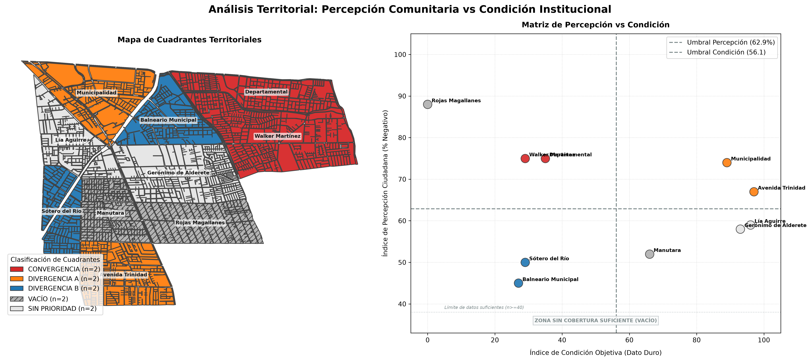

# Integración de Datos

**Sesión 6.2 · Día 6 · 1,5 horas · Modalidad Meet · Docente: Denis
Berroeta (UAI)**

## Resumen ejecutivo {.unnumbered}

Esta sesión cierra el recorrido técnico del Módulo 2. Ya capturaste datos con
mapeos y sensores, procesaste opiniones mediante NLP y mediste la capa
perceptual del territorio. Ahora toca reunir esas piezas con censos, registros
administrativos y cartografía oficial.

El **Small Data comunitario** es rico, situado y cargado de experiencia
vivida, pero parcial: habla de las personas, territorios y momentos que
efectivamente participaron. El **Big Data institucional** es exhaustivo,
sistemático y comparable, pero no sabe cómo se vive un problema y puede ser
grueso o estar desactualizado [@kitchin_data_2014]. Ninguno representa por sí
solo el territorio completo. La evidencia más útil nace de cruzarlos: el dato
comunitario dice **qué importa y dónde duele**; el institucional dice **cuánto,
para cuántas personas y comparado con qué**.

La práctica usa el mismo caso sintético y declarado de La Florida de la sesión
6.1: el tablero de percepción de 1.632 comentarios se cruza con condiciones
de infraestructura por los mismos diez barrios. El entregable es una **ficha
de evidencia territorial** de dos páginas: evidencia trazable para la sesión
7.1, no una recomendación de política pública adelantada.

Al finalizar la sesión serás capaz de:

1. **Distinguir** Small Data comunitario y Big Data institucional, con sus
   fortalezas y puntos ciegos.
2. **Evaluar** la cobertura de un dato comunitario antes de generalizarlo.
3. **Llevar** ambas fuentes a una unidad territorial común y verificar que el
   cruce no pierde ningún territorio.
4. **Construir** un índice de percepción y un índice de condición con reglas,
   pesos y umbrales declarados.
5. **Clasificar** territorios como convergencia, divergencia o vacío, siempre
   evaluando primero la cobertura insuficiente.
6. **Producir** una ficha de evidencia que separe hecho, interpretación,
   acción de verificación y vacíos de información.

## Contenidos de la sesión {.unnumbered}

- Dos mundos de datos que no se hablan: aportes y límites.
- Representatividad práctica: quién habla, por quién y desde dónde.
- Unidad territorial común, normalización y uniones de tablas seguras.
- Mapa de cuadrantes: convergencia, dos divergencias, sin prioridad y vacío.
- Cuadernillo de cinco prompts para construir la ficha de evidencia.
- Extrapolación honesta, chequeos de control y cierre del Módulo 2.

## Dos mundos de datos que no se hablan

### Lo que ya hiciste con ambos

Lo producido en las sesiones previas ya es Small Data: mapeos participativos
(4.1–4.2), sensores ciudadanos (5.1), opiniones sistematizadas (5.2) y
percepción por tema, lugar y tiempo (6.1). Los censos, registros, capas
oficiales y datos de movilidad trabajados en el Módulo 1 son Big Data
institucional.

| Criterio | Small Data comunitario | Big Data institucional |
|---|---|---|
| Cobertura | Parcial: voces y lugares que participaron | Amplia y sistemática |
| Actualidad | Cercana al momento vivido | Puede estar rezagada |
| Significado | Alto: experiencia y contexto local | Menor: categorías homogéneas |
| Sesgo | Participación, canal y territorio | Definiciones administrativas y escala |
| Pregunta que responde mejor | ¿Qué importa y dónde duele? | ¿Cuánto, para quiénes y frente a qué comparación? |

Cada fuente aislada puede engañar de una forma distinta. Un diseño puede ser
técnicamente impecable y fracasar si ignora cómo se mueve o percibe la gente;
una demanda intensa, en cambio, puede corresponder a un sector pequeño y no a
la totalidad de la comuna. El caso de Transantiago recuerda el primer riesgo;
la experiencia de Google Flu Trends recuerda el segundo: los datos masivos
necesitan una lectura situada que los calibre.

::: {.callout-tip title="Analogía: el examen y la conversación"}
El Big Data se parece a un examen de laboratorio: es comparable y preciso en
lo que mide, pero no sabe cómo se siente el paciente. El Small Data es la
conversación clínica: rica y directa, pero parcial. Un diagnóstico responsable
necesita ambas cosas.
:::

### Representatividad sin esconderse detrás de una palabra

Antes de generalizar una observación comunitaria, responde tres preguntas:

1. ¿Quién participó y quién no: edad, sector, canal o condición de acceso?
2. ¿Qué territorios cubre el dato y cuáles quedaron en silencio?
3. ¿Qué tan distinta es la población cubierta de aquella que no lo está?

El dato de un taller, una aplicación o una red social puede valer mucho; sólo
debe hablar con honestidad por quienes estuvieron allí. Estas tres respuestas
forman parte de la ficha final, no son una nota al pie.

## El método del cruce

### Una unidad territorial común

Dos fuentes sólo se pueden cruzar cuando comparten una unidad territorial:
manzana, zona censal, barrio o grilla. El equipo elige la unidad según la
decisión que quiere informar y la disponibilidad de datos; la IA puede
traducir escalas —puntos a conteos por zona, comentarios a indicadores por
barrio—, pero no decide por el equipo qué escala tiene sentido.

La validación conserva el hábito de todas las sesiones: revisar una muestra,
los identificadores y las sumas antes de creer una tabla atractiva.

### Kit de La Florida: continuidad con la sesión 6.1

| Componente | Archivo del kit | Contenido |
|---|---|---|
| Small Data | `small_data_percepcion_barrio.csv` | n de comentarios, % negativo, índice de percepción, emoción, tema y cobertura. |
| Big Data | `big_data_institucional_barrio.csv` | Luminarias, denuncias, delitos, áreas verdes, cámaras y fase del plan. |
| Geometría | `barrios_la_florida.geojson` | Diez barrios construidos desde manzanas censales INE, con población y viviendas. |
| Unidad fina | `manzanas_la_florida.geojson` | Capa para explorar un cruce de mayor resolución cuando corresponda. |

Cualquier material propio entra al mismo método: cambia la tabla, no la
lógica. Si un equipo no dispone de información completa, usar el kit no es un
fracaso; permite practicar el flujo completo y reconocer qué faltaría levantar
en un caso propio.

### El mapa de cuadrantes

El cruce se lee en tres imágenes: percepción por barrio, condición objetiva
por barrio y mapa categórico de cuadrantes. Primero se revisa el **vacío**:
una unidad con cobertura insuficiente no se clasifica con un porcentaje
inestable, aunque parezca alto.

| Resultado | Condición | Lectura inicial | Siguiente paso |
|---|---|---|---|
| **Vacío** | Cobertura comunitaria insuficiente | Territorio sin voz suficiente | Ir a terreno y levantar datos. |
| **Convergencia** | Percepción mala + condición objetiva baja | Ambos mundos coinciden | Prioridad de intervención y verificación operativa. |
| **Divergencia A** | Percepción mala + condición objetiva alta | Malestar con indicadores relativamente favorables | Investigar, comunicar y activar conversación. |
| **Divergencia B** | Percepción buena + condición objetiva baja | Problema físico silencioso | Verificar e intervenir antes del conflicto. |
| **Sin prioridad** | Percepción baja + condición objetiva alta | Sin señal crítica en este cruce | Mantener observación; no equivale a “problema resuelto”. |

::: {.callout-important}
**El vacío gana siempre.** Un 88% negativo sobre 24 comentarios no es una
tendencia: es una anécdota con decimales. El vacío es una ausencia de evidencia
para leer ese territorio, no una categoría de mal desempeño.
:::

### Cuatro barrios, cuatro lecturas

En el caso de La Florida, Walker Martínez combina percepción 75, condición 29
y `n=329`: es convergencia. Municipalidad combina percepción 74, condición 89
y `n=399`: divergencia A; el sector que más comenta no es necesariamente el
peor servido. Balneario Municipal presenta percepción 45, condición 27 y
`n=114`: divergencia B, un problema físico que aún no se expresa con fuerza.

Rojas Magallanes tiene una condición muy baja, pero sólo 24 comentarios: es
vacío. Precisamente por eso se prioriza levantar información allí, no estimar
su percepción ni relegarlo por tener pocos reclamos. Buscar sólo donde hay
datos es como buscar las llaves bajo el farol: hay luz, pero quizá no están ahí.

## Cuadernillo de prompts para la integración

### Antes de copiar un prompt: prepara el contexto

Los cinco prompts **no son instrucciones autónomas**. La frase “te entrego”
significa que, antes de enviarlo, el equipo debe adjuntar los archivos o pegar
las tablas reales y reemplazar cada texto entre corchetes. Un modelo no conoce
el territorio, los archivos de sesiones anteriores ni las decisiones del
equipo si no se le entregan en esa misma conversación.

Usa los prompts en orden (A → B → C → D → E) y conserva los resultados de cada
paso para alimentar el siguiente. Al abrir una conversación nueva, vuelve a
pegar este bloque mínimo de contexto:

```text
CONTEXTO DEL PROYECTO
- Problema territorial: [pregunta concreta].
- Territorio y período analizado: [comuna/sector] — [fechas].
- Unidad territorial e identificador: [por ejemplo, barrio] — [por ejemplo,
  id_barrio].
- Decisiones ya tomadas: umbral de cobertura [n], indicadores y pesos
  [lista], y qué significa una condición alta/baja.
- Fuentes adjuntas o pegadas en este mensaje: [nombres exactos de archivos o
  tablas].
- Restricción: trabaja sólo con los datos entregados; no inventes unidades,
  valores, fuentes ni contexto. Si falta algo, detente y enumera qué falta.
```

Si se usa el kit, los archivos de ese bloque son
`small_data_percepcion_barrio.csv`, `big_data_institucional_barrio.csv` y,
para el mapa, `barrios_la_florida.geojson`. Si se usan datos propios, se
reemplazan por los archivos equivalentes. Nunca basta con enviar sólo el texto
del prompt: hay que adjuntar o pegar sus **entradas indicadas**.

### Prompt A — Agregar el Small Data sin borrar silencios

Este paso toma los registros fila a fila de las sesiones anteriores y deja una
fila por unidad territorial. Si vienes de la 6.1, el tablero de percepción por
barrio ya es el resultado de este prompt.

```text
Usa el CONTEXTO DEL PROYECTO y estas dos entradas adjuntas: (1) la tabla de
datos comunitarios fila por fila —id, fecha, fuente, territorio, tema,
polaridad o medición— y (2) la lista maestra completa de unidades del
territorio con su identificador. Si falta una de las dos, no proceses.

Agrégalos por [UNIDAD TERRITORIAL] y devuelve UNA fila por cada unidad de la
lista maestra, incluidas las que tienen pocos datos o ninguno.

COLUMNAS
unidad | n_registros | n_por_fuente | pct_negativo |
indice_percepcion | emocion_dominante | tema_dominante | cobertura

`indice_percepcion` es el porcentaje de registros negativos, entre 0 y 100.
`cobertura` es `suficiente` si n >= [UMBRAL] e `INSUFICIENTE` en otro caso.

REGLAS
1. Excluye filas vacías o fuera de tema.
2. No omitas, completes con vecinas ni estimes una unidad con pocos registros:
   conserva su n real y marca cobertura INSUFICIENTE.
3. Bajo el umbral no calcules porcentaje: deja esa celda vacía.
4. Declara al final total de filas agregadas y filas sin unidad declarada;
   ambos deben sumar el total de entrada.
```

El umbral lo elige el equipo y se justifica por el contexto. En el kit de La
Florida es `n >= 40`; en un proyecto pequeño puede ser menor, pero nunca se
debe ajustar después de mirar qué barrio queda arriba.

### Prompt B — Traer el Big Data: un join que no puede perder barrios

```text
Usa el CONTEXTO DEL PROYECTO y estas dos entradas adjuntas: (1) el resultado
completo del Prompt A y (2) la tabla institucional por [UNIDAD TERRITORIAL]
—población, viviendas y registros pertinentes—. Confirma primero que ambas
tablas usan el identificador [NOMBRE_DEL_IDENTIFICADOR]. Si no lo usan o falta
una tabla, detente y explica la incompatibilidad.

1. Únela con la tabla comunitaria por el identificador de unidad.
2. Convierte valores absolutos en tasas comparables por 1.000 habitantes o
   km², según corresponda. Declara la unidad y por qué se eligió.
3. Construye `indice_condicion` entre 0 y 100, donde 100 es la mejor condición
   objetiva, con estos pesos definidos por el equipo:
   - [INDICADOR 1] 30% (más/mejor o menos/mejor)
   - [INDICADOR 2] 25% (más/mejor o menos/mejor)
   - [INDICADOR 3] 25% (más/mejor o menos/mejor)
   - [INDICADOR 4] 20% (más/mejor o menos/mejor)
   Normaliza min–max sobre estas unidades y explica qué significan 0 y 100.

REGLAS
1. El join no puede perder ni duplicar unidades. Declara filas de cada tabla y
   filas del resultado.
2. Nombra toda unidad presente en una tabla y ausente en la otra.
3. No inventes valores faltantes: usa `sin_dato`.
```

Los pesos no son un detalle técnico. En La Florida se consideran porcentaje
de luminarias operativas, denuncias por mil habitantes, delitos por mil
habitantes y m² de área verde por habitante. En otro problema, el equipo debe
explicar por qué esos indicadores y esos pesos expresan la condición relevante.

### Prompt C — Clasificar cuadrantes con el vacío primero

```text
Usa el CONTEXTO DEL PROYECTO y la tabla unida completa producida en el Prompt
B. No clasifiques si faltan `n_registros`, `cobertura`,
`indice_percepcion` o `indice_condicion`; informa las columnas o unidades que
faltan.

Sobre esa tabla, clasifica cada unidad territorial.

Calcula y declara ANTES de clasificar:
- umbral_percepcion: promedio de `indice_percepcion` con cobertura suficiente;
- umbral_condicion: promedio de `indice_condicion`;
- umbral_lectura: n_registros >= [UMBRAL].

Aplica estas reglas en este orden exacto:
1. cobertura INSUFICIENTE -> VACÍO
2. percepción alta y condición baja -> CONVERGENCIA
3. percepción alta y condición alta -> DIVERGENCIA A
4. percepción baja y condición baja -> DIVERGENCIA B
5. percepción baja y condición alta -> SIN PRIORIDAD

El VACÍO gana siempre. Devuelve:
unidad | n | indice_percepcion | indice_condicion | cuadrante | que_hacer

En `que_hacer`, escribe una sola línea de acción. Al final informa los tres
umbrales y el número de unidades en cada cuadrante.
```

Un cuadrante sin umbrales explícitos no se puede discutir en una reunión. La
regla de orden evita que un porcentaje construido sobre pocos registros se
disfrace de convergencia y llegue injustificadamente al primer lugar de una
lista de prioridades.

### Prompt D — Hacer visible el cruce con vibe coding

```text
Usa el CONTEXTO DEL PROYECTO y adjunta: (1) [ARCHIVO].geojson, (2) el CSV o la
tabla completa de cuadrantes producida en el Prompt C y (3) los nombres
exactos de las columnas de unión en cada archivo. No supongas rutas, columnas
ni sistema de coordenadas: si no están disponibles, pídemelos.

Escribe código Python, comentado en español, para generar el mapa de
cuadrantes a partir de esos archivos.

1. Une geometría y tabla por el identificador territorial; antes de dibujar,
   imprime cuántas unidades no encontraron par.
2. Dibuja categorías: CONVERGENCIA rojo; DIVERGENCIA A naranjo;
   DIVERGENCIA B azul; VACÍO gris con achurado o textura; SIN PRIORIDAD gris
   muy claro. Rotula los nombres de las unidades.
3. Incluye leyenda con cada cuadrante y su n de unidades.
4. Al lado, genera un gráfico de dispersión: X = indice_condicion, Y =
   indice_percepcion, líneas de ambos umbrales y puntos rotulados.

REGLAS
- El VACÍO debe verse distinto: es ausencia de dato, no un valor bajo.
- No uses escalas continuas; son cinco categorías.
- Explícame qué hará el código antes de ejecutarlo.
```



El mapa y el gráfico de dispersión son dos formas de revisar la misma lógica:
el primero sitúa las decisiones; el segundo permite verificar visualmente los
umbrales y las cuatro zonas del cruce.

### Prompt E — Redactar la ficha de evidencia territorial

La ficha es el puente hacia el Módulo 3. Su tarea es dejar evidencia legible y
auditada; las recomendaciones de política pública se construyen después, con
más contexto institucional. En ese módulo el equipo identificará y priorizará
casos de uso, dimensionará capacidades y riesgos —incluido el marco NIST de IA
responsable— y construirá una hoja de ruta para su institución.

```text
Usa el CONTEXTO DEL PROYECTO y adjunta el resultado completo del Prompt C,
incluidos sus umbrales, además de la lista de fuentes usada en los Prompts A y
B. Añade este contexto de destinatario: la ficha será usada en el Módulo 3
para priorizar casos de uso institucionales, capacidades, riesgos y una hoja
de ruta; aún no se decide una política pública.

Redacta una ficha de evidencia territorial de máximo dos páginas para el
equipo que trabajará el Módulo 3. Si no cuentas con la tabla clasificada, los
umbrales y las fuentes, no redactes una ficha: indica exactamente qué insumo
falta.

ESTRUCTURA OBLIGATORIA
1. PROBLEMÁTICA: pregunta territorial en una frase.
2. DATOS USADOS: dos listas separadas —comunitarios e institucionales— con
   fecha, cobertura y responsable de cada fuente.
3. HALLAZGO: HECHO (con n) / INTERPRETACIÓN (hipótesis declarada) / ACCIÓN
   (de verificación o gestión).
4. TERRITORIOS PRIORITARIOS: cinco primeros, cuadrante y una línea de por qué.
5. VACÍOS DECLARADOS: territorios y grupos sin dato, y qué falta levantar.
6. PREGUNTA AL MÓDULO 3: la que el equipo llevará a la sesión 7.1.

REGLAS
1. Ninguna afirmación sin n; toda interpretación debe estar marcada como
   hipótesis.
2. Los vacíos son resultado, no descargo de responsabilidad.
3. Declara en la misma frase si algo es estimación y no observación.
4. No recomiendes políticas públicas: entrega evidencia para decidir.
5. Lenguaje claro para alguien que no asistió a las sesiones.
```

<div class="ficha-evidencia-interactiva">
  <iframe
    src="html-apps/ficha_evidencia_interactiva.html"
    title="Ficha de evidencia territorial interactiva de La Florida"
    loading="lazy"
    allowfullscreen>
  </iframe>
</div>

<p class="ficha-evidencia-ayuda">Explora la ficha, el mapa y la matriz de
priorización. Puedes interactuar con los barrios directamente en el mapa o en
la matriz.</p>

<style>
.ficha-evidencia-interactiva {
  width: 100%;
  height: min(78vh, 880px);
  min-height: 620px;
  margin: 1.5rem 0 0.75rem;
  overflow: hidden;
  border: 1px solid #d7dce5;
  border-radius: 0.75rem;
  box-shadow: 0 0.6rem 1.8rem rgba(17, 24, 39, 0.13);
  background: #090d16;
}

.ficha-evidencia-interactiva > p {
  height: 100%;
  margin: 0;
}

.ficha-evidencia-interactiva iframe {
  display: block;
  width: 100%;
  height: 100%;
  border: 0;
}

.ficha-evidencia-ayuda {
  margin: 0 0 2rem;
  color: #5b6573;
  font-size: 0.9rem;
}

@media (max-width: 768px) {
  .ficha-evidencia-interactiva {
    height: 76vh;
    min-height: 560px;
    margin-top: 1rem;
    border-radius: 0.5rem;
  }
}
</style>


## Actividad: construir la ficha de evidencia

En salas por familia temática —residuos, verde-hídrico, movilidad o
plataformas y datos— cada equipo aplica los cinco prompts sobre su material.
Un vocero comunica bloqueos y decisiones al curso. Si no hay material propio
completo, se utiliza el kit de La Florida; el objetivo es dominar el método,
no simular una completitud inexistente.

1. Agrega el Small Data por la unidad territorial elegida.
2. Normaliza y une el Big Data sin perder ni duplicar unidades.
3. Clasifica cuadrantes con umbrales y cobertura declarados.
4. Genera el mapa categórico y el gráfico de dispersión.
5. Redacta la ficha de dos páginas y revisa los chequeos antes de entregarla.

::: {.callout-tip title="Cinco chequeos antes de creer la tabla"}
El join no pierde unidades; nadie queda huérfano entre las dos tablas; ningún
porcentaje se lee bajo el umbral; cada valor distingue observado de estimado;
la suma de unidades por cuadrante coincide con el total del territorio. Treinta
segundos por chequeo separan una ficha defendible de una ficha sólo bonita.
:::

## Extrapolar sin mentir

Cuando una IA “completa” un territorio sin dato, busca similitudes entre
características conocidas: si barrios observados se parecen a otro en ciertas
variables, puede proponer una estimación. No ha observado ese barrio; ha
producido una hipótesis basada en semejanza.

Dos reglas no tienen excepción:

1. Declarar siempre qué es **observado** y qué es **estimado**.
2. No tomar una decisión irreversible sobre un territorio que sólo cuenta con
   una estimación.

El modelamiento territorial representativo es una brújula para decidir dónde
levantar más información. Una estimación bien declarada orienta; una estimación
disfrazada de dato miente.

## Cierre del Módulo 2

El ciclo completo del dato ciudadano queda así:

| Momento | Sesiones | Producto |
|---|---|---|
| **Capturar** | 4.1–4.2 y 5.1 | Territorio dibujado y medido. |
| **Procesar** | 5.2 | Opiniones organizadas con trazabilidad. |
| **Percibir** | 6.1 | Sentimiento por tema, tiempo y territorio. |
| **Integrar** | 6.2 | Evidencia comparada, priorizada y con vacíos declarados. |

El principio territorial que cierra el módulo es simple: **ningún dato
representa al territorio completo**. La ficha declara sus silencios porque un
mapa sin vacío aparente puede estar ocultando precisamente el lugar donde más
falta aprender.

Del prompt al mapa; del mapa a la evidencia; de la evidencia a la decisión.
El Módulo 3 lleva ese recorrido a la institución de cada equipo.

## Resumen

- Small Data y Big Data son complementarios: uno aporta experiencia situada;
  el otro, cobertura y comparación. Cada uno por separado tiene puntos ciegos.
- Para integrarlos, ambos deben compartir una unidad territorial y un
  identificador verificable; un join que pierde barrios invalida el mapa.
- La cobertura insuficiente se evalúa primero: el vacío es hallazgo y orienta
  el siguiente levantamiento participativo.
- Convergencia y divergencias no son sentencias automáticas: son lentes para
  verificar, comunicar e investigar con mejor evidencia.
- Los umbrales, pesos, tasas y estimaciones se declaran; la IA calcula y
  traduce, mientras el equipo conserva las decisiones de sentido.
- La ficha de evidencia territorial cierra el Módulo 2 y es insumo formal de
  la sesión 7.1.

## Recursos

- **Kit La Florida**: `small_data_percepcion_barrio.csv`,
  `big_data_institucional_barrio.csv`, `barrios_la_florida.geojson` y
  `manzanas_la_florida.geojson`.
- **Prompt-book de integración**: agregación, join seguro, cuadrantes, mapa y
  ficha de evidencia.
- **Plantilla “Ficha de evidencia territorial”**: problemática, fuentes,
  hallazgo, prioridades, vacíos y pregunta para el Módulo 3.
- **Checklist del cruce**: unidades, huérfanos, umbral, observado/estimado y
  mapa que cuadra.
- Capa censal y unidades territoriales INE trabajadas desde la sesión 3.2.
