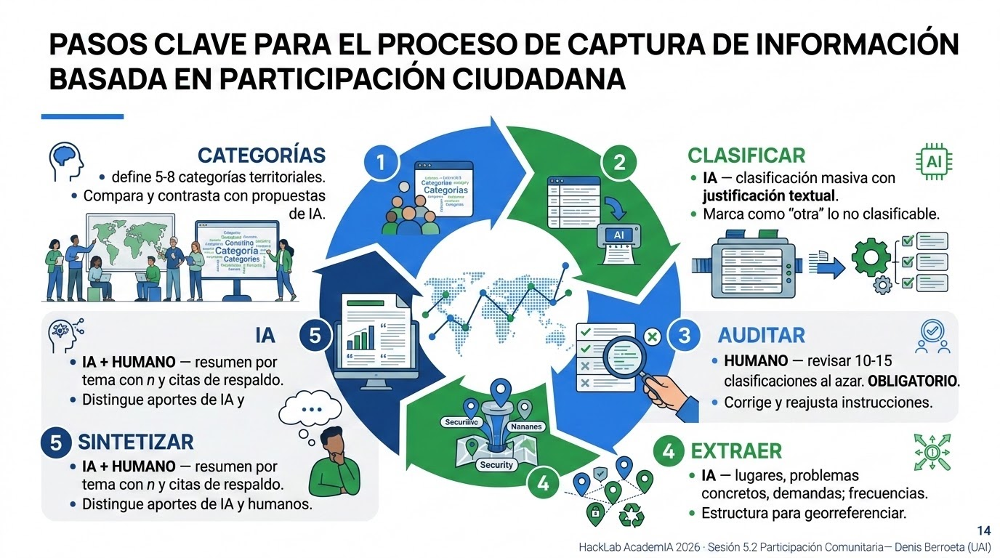

# NLP Comunitario

**Sesión 5.2 · Día 5 · Modalidad Presencial · Docente:
Denis Berroeta (UAI)**

## Resumen ejecutivo {.unnumbered}

Cada proceso participativo serio produce un problema hermoso:
**demasiadas palabras**. Una consulta ciudadana puede generar 3.000
respuestas abiertas; un PLADECO, cientos de páginas de actas; una
cuenta pública, miles de comentarios. Tradicionalmente ese material
termina sub-analizado —se leen 200 respuestas, se citan 10— o tarda
meses en sistematizarse, cuando la decisión ya se tomó. El resultado es
doblemente grave: se pierde información y se traiciona la confianza del
vecino que se dio el tiempo de opinar.

{fig-align="center" width="500"}

El **Procesamiento de Lenguaje Natural (NLP)** —la rama de la IA que
trabaja con texto humano [@jurafsky_speech_2025]— cambia esa ecuación:
hoy es posible clasificar, agrupar por temas y sintetizar miles de
opiniones en horas, manteniendo trazabilidad hacia las voces
originales. Esta sesión enseña el flujo completo en un proyecto de
****: del archivo caótico de respuestas a
un informe temático defendible, con la IA como sistematizadora incansable
y tú como **supervisor del sentido**. El proyecto conserva scripts,
resultados y decisiones del equipo para que el análisis pueda revisarse y
reproducirse.

Al finalizar la sesión serás capaz de:

1.  **Explicar** qué es el NLP y sus operaciones útiles para la gestión
    pública: clasificar, extraer, agrupar, resumir.
2.  **Cargar y explorar un corpus de participación en un proyecto de
    **: reconocer su estructura, vacíos y
    duplicados antes de analizarlo.
3.  **Ejecutar una clasificación temática asistida por IA** sobre
    respuestas abiertas: definir categorías, clasificar
    masivamente, auditar una muestra.
4.  **Extraer estructura desde texto libre**: de la frase del vecino al
    dato procesable.
5.  **Producir una síntesis fiel y trazable**: resúmenes por tema con
    citas textuales de respaldo.
6.  **Aplicar salvaguardas éticas**: anonimización, sesgos del modelo, y
    el principio de supervisión humana.

## Contenidos de la sesión {.unnumbered}

-   El problema de las mil voces: el cuello de botella de la
    participación.
-   Qué es el NLP y su menú de operaciones para un municipio.
-   El corpus de seguridad del taller: estructura de archivos y trabajo
    en un proyecto de .
-   Anonimización y protección de datos personales.
-   Taller de seguridad: de ~400 opiniones a un informe temático en
    cinco pasos.
-   Ética y límites: sesgos, voces minoritarias, transparencia.

## El problema de las mil voces

### El cuello de botella de la participación

Ejemplos reales del material participativo sub-analizado: consultas
ciudadanas, PLADECO, presupuestos participativos. El costo es doble:

-   **Costo institucional**: decisiones tomadas sin la información que
    ya se había recolectado.
-   **Costo de confianza**: el vecino que opinó y nunca vio reflejada su
    voz no vuelve a participar.

### Qué es el NLP

En una frase: **enseñar a la máquina a trabajar con texto humano**.
Breve genealogía honesta: antes requería equipos especializados; los
modelos de lenguaje actuales lo pusieron al alcance de un prompt bien
hecho.

El menú de operaciones útiles para un municipio:

| Operación | Ejemplo municipal |
|----|----|
| **Clasificar** | Asignar cada respuesta a un tema (seguridad, áreas verdes, basura...) |
| **Extraer** | Sacar lugares, problemas y demandas mencionados en el texto |
| **Agrupar** | Juntar opiniones que dicen lo mismo con palabras distintas |
| **Resumir** | Condensar 500 respuestas sobre un tema en un párrafo fiel |
| **Traducir registro** | Pasar del lenguaje técnico al ciudadano y viceversa |

### De la frase del vecino al dato procesable

El ejemplo canónico de la sesión:

> *"La plaza de la esquina de mi casa está oscura y da miedo de noche."*

se convierte en:

| Campo | Valor |
|----|----|
| Tema | Seguridad |
| Subtema | Iluminación |
| Lugar | Plaza |
| Tono | Negativo |

<!-- ::: {.callout-note appearance="simple" icon="false"} -->
<!-- 📷 **IMAGEN PENDIENTE**: Diagrama de transformación: a la izquierda, la -->
<!-- frase manuscrita/en globo de diálogo del vecino; una flecha con el -->
<!-- rótulo "NLP"; a la derecha, la tabla estructurada {tema, subtema, -->
<!-- lugar, tono}. Debe mostrar que la voz no se pierde: se ordena. -->
<!-- ::: -->

::: {.callout-tip title="Analogía: la secretaria incansable"}
Imagina una secretaria de actas que lee las 3.000 respuestas sin
cansarse, las clasifica en carpetas, anota de qué lugar habla cada una
y te deja una cita textual como respaldo de cada decisión de archivo.
Eso es el NLP con modelos de lenguaje. Pero como toda secretaria nueva,
**hay que revisarle el trabajo al principio**: de eso trata la
auditoría humana.
:::

## El corpus del taller y Antigravity

### Archivos disponibles

El taller utiliza únicamente `corpus_5_2_local/corpus_seguridad.csv`: un
corpus sintético de participación ciudadana sobre seguridad en comunas de la
Región Metropolitana. Los datos son sintéticos, pero incluyen dificultades
habituales de un proceso real para que el equipo pueda detectarlas y discutirlas.

| Archivo | Uso | Contenido |
|---|---|---|
| `corpus_seguridad.csv` | Archivo de trabajo del taller. | 412 respuestas abiertas sobre seguridad. |
| `clave_seguridad.csv` | Referencia docente posterior. | Etiquetas esperadas y rasgos plantados. |
| `gen_corpus_5_2_local.py` | Reproducibilidad del material. | Generador Python sin dependencias externas. |
| `README.md` | Guía del material. | Descripción, tamaños e instrucciones de reproducción. |

El archivo `corpus_seguridad.csv` tiene esta estructura:

| Columna | Descripción |
|---|---|
| `id` | Identificador de la respuesta, por ejemplo `SEG-0001`. |
| `respuesta` | Texto abierto de la participación; es la columna principal del análisis. |
| `comuna` | Comuna declarada, cuando existe. |
| `canal` | Origen: consulta web, cabildo, formulario en papel, WhatsApp municipal o buzón vecinal. |
| `grupo_edad` | Tramo etario declarado, cuando existe. |

El corpus tiene **412 filas**: 400 respuestas base y 12 duplicados exactos
(3%) incorporados intencionalmente. Además, contiene casos ambiguos (~4%),
datos personales ficticios (~8%), disensos (~6%), respuestas vacías o casi
vacías (~2%), respuestas fuera de tema (~5%) y filas sin comuna o grupo de
edad (~30%). No son defectos que haya que ocultar: son parte del ejercicio de
control de calidad.

La `clave_seguridad.csv` incluye las columnas docentes `tema`, `subtema`,
`lugar`, `tono`, `es_ambiguo`, `contiene_pii`, `es_disenso` y
`es_duplicado`. Se consulta al final para revisar el proceso; no debe usarse
como respuesta antes de la auditoría del equipo.

### Primeros pasos en Antigravity

1. Abre en  la carpeta del proyecto de la
   sesión y verifica que contiene `corpus_5_2_local/corpus_seguridad.csv`.
2. Pide al agente que genere los scripts de carga y exploración; revísalos
   antes de ejecutarlos.
3. Conserva en el proyecto los scripts, CSV derivados, tablas de resultados
   y decisiones que respalden el análisis.

**Prompt — cargar y conocer el corpus**

```text
En este proyecto, crea y ejecuta el script
`scripts/01_explorar_corpus.py`. Debe leer el archivo
`corpus_5_2_local/corpus_seguridad.csv` mediante una ruta relativa.

Genera y ejecuta código Python con pandas para cargarlo como una tabla
llamada `corpus`. La columna de texto a analizar es exactamente `respuesta`;
no uses ni renombres otra columna como texto principal.

Muestra las primeras cinco filas, el total de filas, los nombres y tipos de
columnas, los valores faltantes por columna, y el largo promedio, mínimo y
máximo —en palabras— de `corpus["respuesta"]`. Muestra también cinco filas
aleatorias con `random_state=52`.

No elimines ni modifiques datos todavía. Conserva `corpus` como la tabla
original durante toda esta etapa y guarda un resumen reproducible en
`resultados/01_exploracion.md`.
```

**Prompt — control de calidad inicial**

```text
En este proyecto, crea y ejecuta el script
`scripts/02_control_calidad.py`. Debe leer `corpus_seguridad.csv` con una
ruta relativa, cargarlo como `corpus` y trabajar explícitamente sobre
`corpus["respuesta"]`.

Detecta respuestas vacías o casi vacías —incluyendo "no sé", "-" y "s/i"—,
duplicados exactos en la columna `respuesta`, y el porcentaje de valores
faltantes en `comuna`, `canal` y `grupo_edad`. Entrega números concretos, los
`id` de las filas duplicadas y una tabla-resumen.

No elimines, edites ni sobrescribas `corpus`; si necesitas columnas o tablas
auxiliares, créalas con nombres nuevos. Guarda el resumen y los duplicados
detectados dentro de `resultados/`.
```

Antes de analizar con IA, explora lo que realmente cargaste: cuántas
respuestas hay, cuáles están vacías, cuáles se repiten y qué contexto
territorial está disponible. Cada decisión debe quedar registrada en un
archivo de notas o resultados del proyecto.

::: {.callout-note}
**Regla de trabajo:** una celda, una pregunta. Deja visible el resultado que respalda cada decisión: filas excluidas, categorías definidas y cambios a las instrucciones de clasificación.
:::


## Preparar el corpus: del archivo caótico a la tabla procesable

### El corpus mínimo viable

-   **Una opinión por fila.**
-   Columnas de contexto si existen: comuna, edad, canal de
    recolección.
-   ¿PDFs y actas escaneadas? La IA también extrae texto de documentos:
    pídeselo.

### Anonimización antes de procesar

Antes de procesar, **detecta y remueve** nombres, RUT, teléfonos y
direcciones exactas. La IA puede asistir esta limpieza, pero el resultado se
revisa antes de continuar. El objetivo es anonimizar a la persona, no borrar
el territorio: una plaza, paradero o calle sin numeración sigue siendo
información necesaria para el análisis.

**Prompt A — anonimizar antes de analizar**

```text
En este proyecto, crea y ejecuta el script `scripts/03_anonimizar.py`.
Debe leer `corpus_5_2_local/corpus_seguridad.csv` con una ruta relativa y
cargarlo como una tabla pandas llamada `corpus`. Genera una función que cree
una copia llamada `corpus_anonimizado`; debe modificar solamente la columna
`respuesta`, conservar sin cambios `id`, `comuna`, `canal` y `grupo_edad`, y
agregar `pii_detectada` a la copia.

En `corpus_anonimizado["respuesta"]`, limpia datos personales antes de
analizarlos.

Reemplaza en cada respuesta:
- Nombres y apellidos de personas -> [NOMBRE]
- RUT (12.345.678-9, 12345678-9, 123456789) -> [RUT]
- Telefonos (+569 XXXX XXXX, 9 XXXX XXXX, fijos) -> [TEL]
- Direcciones de domicilio, o sea calle o pasaje CON numeracion
  ("Los Aromos 1234", "pasaje Las Lilas 45, depto 3B") -> [DOMICILIO]
- Correos, patentes, cuentas de redes sociales -> [CONTACTO]

NO REEMPLACES las referencias a lugares publicos. Se conservan tal cual:
plazas, paraderos, ferias, canchas, sedes vecinales, colegios, sitios
eriazos, villas y poblaciones, y calles SIN numeracion.
Esa informacion es del territorio, no de la persona, y la necesitamos despues.

REGLAS
1. No cambies ninguna otra palabra: ni ortografia, ni garabatos, ni
   mayusculas, ni abreviaciones. Debe seguir sonando a quien lo escribio.
2. Manten el mismo id y el mismo orden de las filas.
3. En `pii_detectada`, registra los tipos encontrados separados por `;`
   (por ejemplo, `nombre;domicilio`) o `ninguna`.
4. Si dudas si algo identifica a una persona, reemplazalo y anotalo.

Al terminar, muestra `id`, `respuesta` y `pii_detectada` de diez filas donde
`pii_detectada` no sea `ninguna`. No sobrescribas la tabla original `corpus`;
guarda la copia en `resultados/corpus_seguridad_anonimizado.csv`.
```

Revisa al menos diez filas a ojo. En el corpus, el teléfono de `SEG-0002`
se reemplaza, mientras que una plaza mencionada en una respuesta se conserva.
Esta distinción permite identificar problemas territoriales sin exponer a
quien escribió.

::: callout-important
**Privacidad no es nota al pie.** En tu organización manejarás datos
reales de vecinos. La referencia normativa es la **Ley 21.719 de
Protección de Datos Personales**. Regla del curso: nunca subir datos
personales reales a herramientas de IA, ni durante el curso ni después
sin resguardo institucional.
:::

## Actividades

{fig-align="center" width="900"}

### Taller en Antigravity: de ~400 opiniones a un informe temático

El flujo se realiza en el proyecto de  sobre
la copia anonimizada de `corpus_seguridad.csv` (~412 respuestas). Organiza el
trabajo en carpetas como `scripts/`, `resultados/` y `documentacion/`.
Procesa en tandas de hasta 50 filas cuando pidas análisis a un modelo: así
puedes comprobar que las filas de salida coinciden con las de entrada, que los
`id` son únicos y que no queda información personal residual.

**Paso 1 — Definir categorías (humano).** El equipo propone primero entre
5 y 8 categorías que tengan sentido para la seguridad de su territorio. Sólo
después las contrasta con una propuesta de IA: el conocimiento territorial no
se delega.

**Prompt 1 — contraste de categorías**

```text
Te entregaré una muestra de 60 filas aleatorias de `corpus_anonimizado`.
Cada fila contiene `id` y `respuesta`; analiza sólo el contenido de
`respuesta`.

Las respuestas son de una consulta comunal sobre seguridad. Propón 7
categorías temáticas para clasificarlas todas. Para cada una indica:
- nombre corto de la categoría;
- una línea de qué incluye y qué NO incluye;
- dos ejemplos de respuestas del corpus que caerían ahí.

Las categorías deben ser, en lo posible, mutuamente excluyentes, no ser
cajones de sastre y salir de lo que dice el corpus, no de lo que normalmente
se pregunta sobre seguridad.

CORPUS:
[PEGAR MUESTRA ALEATORIA DE 60 FILAS CON id Y respuesta]

Estas son las categorías que definió nuestro equipo:
[PEGAR CATEGORÍAS DEL EQUIPO]

Compáralas con las 7 que propusiste:
- ¿Qué tema separa tu propuesta que la nuestra junta?
- ¿Qué tema nuestro no aparece en la tuya?
- ¿Cuál de las dos dejaría más respuestas en "otra" y por qué?

No concluyas cuál es mejor. Muestra sólo las diferencias.
Guarda la comparación en `documentacion/01_contraste_categorias.md`.
```

El contraste es el resultado: revela tanto distinciones que el equipo puede
haber unido como matices territoriales que el modelo no conoce.

**Paso 2 — Clasificar masivamente (IA).** Clasifica sin forzar: `otra` es
una salida honesta y, si supera aproximadamente 20%, una señal de que hay que
volver a definir las categorías.

**Prompt 2 — clasificar**

```text
Clasifica cada fila usando sólo el texto de la columna `respuesta`.

CATEGORÍAS ACORDADAS:
[PEGAR CATEGORÍAS ACORDADAS CON UNA LÍNEA DE DEFINICIÓN]

REGLAS
1. Clasifica cada respuesta ciudadana en UNA categoría.
2. Si no calza en ninguna, marca `otra`. No fuerces: es preferible un `otra`
   honesto que una clasificación inventada.
3. Si toca dos categorías, elige la dominante y anota la segunda en
   `categoria_secundaria`.
4. Una fila de entrada = una fila de salida. Mantén el mismo `id` y orden.
5. Devuelve sólo CSV con estas columnas:
   id | categoria | categoria_secundaria | cita | confianza
6. `cita` debe ser un fragmento LITERAL de `respuesta`, de máximo 15
   palabras. Si no puedes citar, la clasificación no está fundada.
7. `confianza` es alta | media | baja. Usa baja cuando el texto sea ambiguo,
   irónico o mezcle temas.

FILAS (id y respuesta; máximo 50):
[PEGAR HASTA 50 FILAS]

Guarda el CSV resultante en `resultados/clasificado_tanda_[N].csv`.
```

La cita hace trazable la etiqueta y la confianza permite dirigir la auditoría
hacia las decisiones más inciertas.

**Paso 3 — Auditar (humano, obligatorio e innegociable).** El equipo revisa
10–15 clasificaciones al azar —y todas las de confianza baja, si son pocas—
contra la respuesta original, no sólo contra su cita. Si hay más de dos o
tres discrepancias en 15 filas, ajusta las reglas y vuelve a clasificar.

**Prompt — muestra reproducible de auditoría**

```text
La tabla `clasificado` contiene las columnas `id`, `respuesta`, `categoria`,
`categoria_secundaria`, `cita` y `confianza`.

En este proyecto, crea y ejecuta el script `scripts/04_muestra_auditoria.py`.
Debe generar con pandas 12 filas aleatorias reproducibles con
`random_state=52`, sin alterar ni sobrescribir `clasificado`. Crea una tabla
llamada `muestra_auditoria`, agrega una columna vacía `revision_humana` para
que el equipo marque conforme, corregir o discutir, y guárdala en
`resultados/muestra_auditoria.csv`.
```

La IA no audita su propio trabajo. Las discrepancias se convierten en casos
límite que se agregan al Prompt 2, por ejemplo: *"[CITA] va en
[CATEGORÍA CORRECTA], no en [CATEGORÍA ASIGNADA], porque [RAZÓN DEL EQUIPO]"*.

**Paso 4 — Extraer estructura (IA).** Separa lo que el texto declara de lo
que el analista podría inferir. Un problema no es necesariamente una demanda:
si una vecina dice que una plaza está oscura, la iluminación deficiente es un
problema; no se debe inventar que pidió instalar luminarias.

**Prompt 4A — extraer fila a fila**

```text
Eres analista de participación ciudadana en una municipalidad chilena.
Te entrego filas ya anonimizadas sobre seguridad; extrae estructura usando
solamente el texto de la columna `respuesta`.

REGLAS INNEGOCIABLES
1. Extrae estructura de CADA fila. Una fila de entrada = una fila de salida;
   conserva `id` y el orden. No agrupes, no resumas, no cuentes.
2. Extrae sólo lo escrito. Si un campo no aparece, escribe `no_declarado`.
   Nunca infieras el lugar a partir del tema ni completes lo que alguien
   seguramente quiso decir.
3. `cita` debe ser un fragmento LITERAL de `respuesta`, de máximo 15 palabras.
4. Si `respuesta` quedó vacía tras la limpieza, usa `sin_contenido`.
5. Devuelve SÓLO CSV, sin comentarios.

COLUMNAS DE SALIDA
`id`, `tema` (una categoría acordada), `subtema` (frase libre de 2 a 4 palabras),
`lugar_texto` (tal como aparece en `respuesta`), `lugar_tipo` (plaza | paradero |
calle_o_pasaje | villa_o_poblacion | sitio_eriazo | equipamiento | comuna_general |
sin_lugar), `problema` (máximo 10 palabras), `demanda` (máximo 10 palabras o
`no_declarada`), `tipo_demanda` (infraestructura | servicio_recurrente |
fiscalizacion | educacion_informacion | n/d), `responsable_mencionado`
(municipio | policia | empresa | vecinos | -), `escala` (domicilio | cuadra |
barrio | comuna), `tono` (positivo | negativo | mixto | neutro) y `cita`.

FILAS (id y respuesta; máximo 50):
[PEGAR HASTA 50 FILAS]

Guarda el CSV resultante en `resultados/extraido_tanda_[N].csv`.
```

**Prompt 4B — normalizar lugares**

```text
Esta es la lista única de valores de `lugar_texto` extraídos desde la columna
`respuesta`, junto con su conteo. Agrupa sólo las variantes que se refieren al
MISMO lugar físico y devuelve:

lugar_canonico     | nombre normalizado y buscable en un mapa
variantes          | formas originales agrupadas, separadas por ;
n_menciones        | suma de menciones de las variantes
geocodificable     | si | no | dudoso
motivo_si_dudoso   | por qué no basta para ubicarlo

REGLAS
1. "El paradero de la esquina", "la plaza de mi casa" y "acá en el barrio"
   no son geocodificables: marca `no`.
2. No agrupes dos lugares sólo porque suenan parecido. Ante duda, marca
   `dudoso` y déjalos separados.
3. No entregues coordenadas, latitud, longitud ni direcciones completas.

LISTA:
[PEGAR LUGARES ÚNICOS CON SU CONTEO]

Guarda el CSV resultante en `resultados/lugares_normalizados.csv`.
```

Normalizar nombres habilita un mapa posterior; no equivale a geocodificar ni
autoriza a inventar ubicaciones.

**Prompt 4C — frecuencias**

```text
En este proyecto, crea y ejecuta `scripts/05_frecuencias.py`. Debe leer la
tabla pandas `extraido` desde su CSV de resultados y calcular con código —no
estimes ni inventes números—:

A) Frecuencia por tema: tema | n | % del total
B) Frecuencia por tema x lugar_canonico: incluye SÓLO celdas con n >= 5
C) Frecuencia por tipo_demanda dentro de cada tema
D) Concentración: los 10 lugares con más menciones y su tema dominante
E) % de filas con `demanda` distinta de `no_declarada`, por tema
F) % de tono negativo por tema

VERIFICACIÓN OBLIGATORIA: al final, la suma de n en (A) debe ser igual al
total de filas de `extraido`. Declara ambos números explícitamente. Si no
cuadran, dilo: no ajustes los números para que calcen.

No modifiques ni sobrescribas `extraido`; guarda cada resultado como una tabla
nueva con nombre descriptivo dentro de `resultados/`.
```

Cuenta en pandas o en una tabla dinámica cuando sea posible. El umbral `n >=
5` protege frente a reidentificación: bajo ese umbral se agrega a un sector o
barrio y no se publica ni se mapea.

**Paso 5 — Sintetizar con trazabilidad (IA + humano).** El modelo redacta un
borrador; el equipo verifica sus números, citas y tratamiento de los disensos.

**Prompt 5 — sintetizar**

```text
Con la tabla `extraido` y las tablas de frecuencias verificadas, redacta un
informe de hallazgos sobre seguridad para una audiencia municipal no técnica.
Usa las citas solamente desde `respuesta` o desde la columna `cita` que las
reproduce literalmente.

ESTRUCTURA POR CADA TEMA
1. Un párrafo de 3 a 5 frases en lenguaje claro, sin tecnicismos.
2. Cada afirmación lleva entre paréntesis el número de respuestas que la
   respalda: `(n=47)`.
3. Después del párrafo, incluye 2 citas textuales literales con su `id`.
4. Indica los lugares más mencionados del tema, con su n de menciones.
5. Indica las demandas concretas más frecuentes, en orden.

OBLIGATORIO: agrega por tema una sección titulada "Disensos y voces
minoritarias" con posturas contrarias a la tendencia mayoritaria, aunque sean
pocas. Cítalas literalmente con su `id` e indica cuántas son. No las suavices,
no las promedies con el resto y no las omitas por ser pocas.

REGLAS
- No agregues recomendaciones ni conclusiones de política.
- Si un tema tiene menos de 10 respuestas, decláralo explícitamente.
- Si algo no está en los datos, no lo escribas.
- Revisa que ninguna cita conserve datos personales.

Extensión total: 1 a 2 páginas.
Guarda el borrador en `resultados/informe_hallazgos_seguridad.md`.
```

El informe no reemplaza el juicio profesional: es un borrador para revisar,
no un producto firmable.

**Producto final**: mini-informe temático (1–2 páginas) que cada equipo
lleva consigo.

<!-- ::: {.callout-note appearance="simple" icon="false"} -->
<!-- 📷 **IMAGEN PENDIENTE**: Diagrama del flujo de 5 pasos del taller como -->
<!-- cadena con íconos, alternando los rótulos "HUMANO" e "IA": definir -->
<!-- categorías (humano) → clasificar (IA) → auditar (humano, destacado en -->
<!-- color como paso crítico) → extraer (IA) → sintetizar (IA+humano). El -->
<!-- paso de auditoría debe sobresalir visualmente. -->
<!-- ::: -->

### Tarea puente (opcional)

Aplica el flujo a un corpus propio (anonimizado) de tu organización y
lleva los hallazgos a la sesión 6.1. Todos tienen un archivo de
respuestas sin procesar esperando.

## Ética y límites

Los tres riesgos y su control:

| Riesgo | Control |
|----|----|
| El modelo clasifica con sesgos | Auditoría humana de muestras, siempre |
| El resumen "alisa" las voces minoritarias | Pedir explícitamente disensos y opiniones minoritarias |
| Sobre-confianza institucional | El informe IA es borrador para el analista, no producto final firmable |

Regla de comunicación pública: **si un análisis fue asistido por IA, se
declara**. Transparencia como política por defecto.

## Resumen

-   El material participativo sub-analizado es información perdida y
    confianza traicionada; el NLP permite procesarlo completo, en
    horas y en español.
-   El corpus mínimo viable: una opinión por fila, contexto en
    columnas, **anonimización antes de procesar** (Ley 21.719).
-   El flujo del curso sobre seguridad tiene 5 pasos: categorías (humano) → clasificación
    (IA) → **auditoría (humano, innegociable)** → extracción (IA) →
    síntesis trazable (IA + humano).
-   La trazabilidad es el sello de calidad: cada afirmación del informe
    lleva su frecuencia y sus citas textuales de respaldo.
-   La IA propone, el profesional dispone: el informe asistido por IA es
    borrador del analista y se declara como tal.
-   Hasta aquí clasificamos **qué** dice la gente; la próxima sesión
    mide **cómo se siente** respecto del entorno urbano.

## Recursos

-   **Corpus del curso**: `corpus_5_2_local/corpus_seguridad.csv`, con
    412 respuestas sintéticas sobre seguridad. Incluye
    `clave_seguridad.csv` para revisión docente, README y generador
    reproducible.
-   **Proyecto de **: espacio para cargar
    el CSV, crear scripts reproducibles, documentar el análisis y auditar
    resultados.
-   **Prompt-book NLP**: los prompts de las 5 etapas del flujo + prompt
    de anonimización.
-   **Plantilla "Informe temático de participación"** (2 páginas):
    metodología declarada, categorías, frecuencias, síntesis por tema
    con citas, disensos, limitaciones.
-   **Ficha "Datos personales y participación" (1 página)**: qué es dato
    personal, qué limpiar antes de procesar, referencia a la Ley 21.719
    y su pertinencia municipal.
-   **Checklist de auditoría de clasificaciones IA**: tamaño de muestra,
    qué mirar, cuándo re-clasificar.
-   Caso documentado breve de sistematización masiva de participación
    con IA, como referencia inspiradora.
