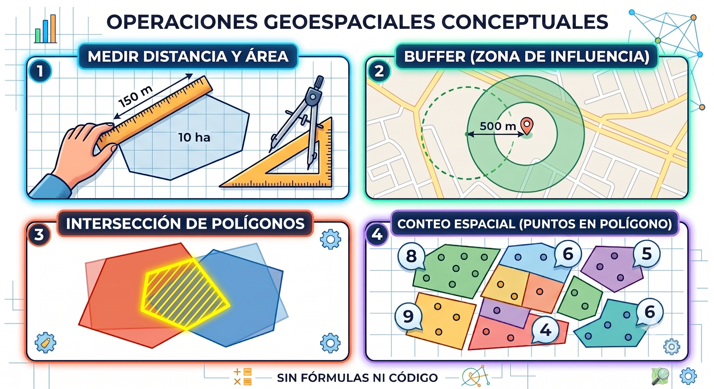
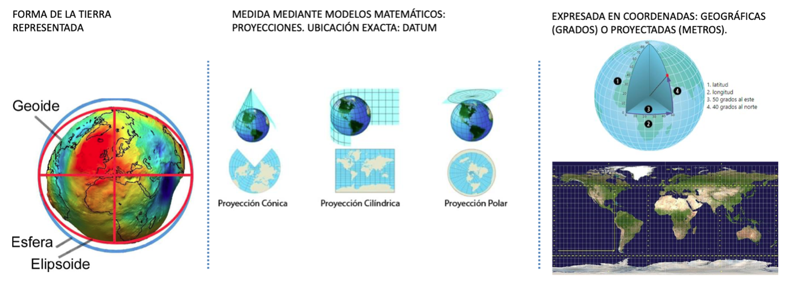
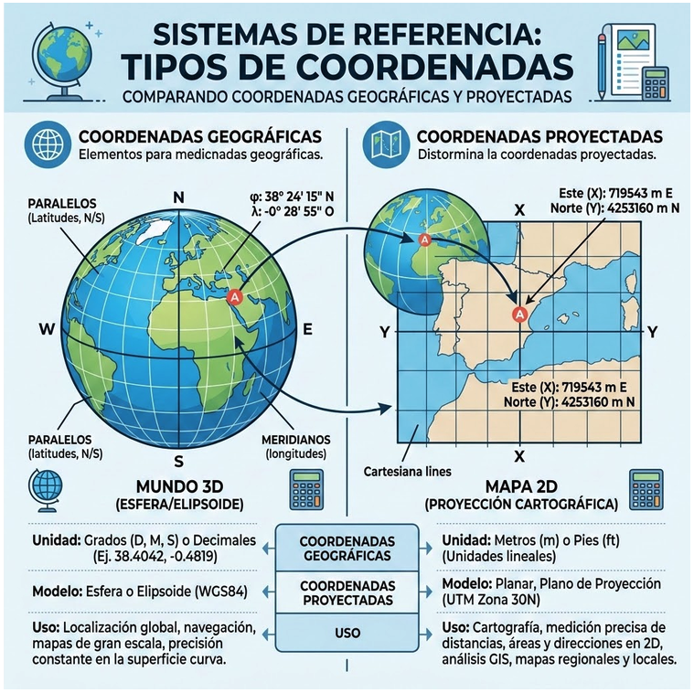
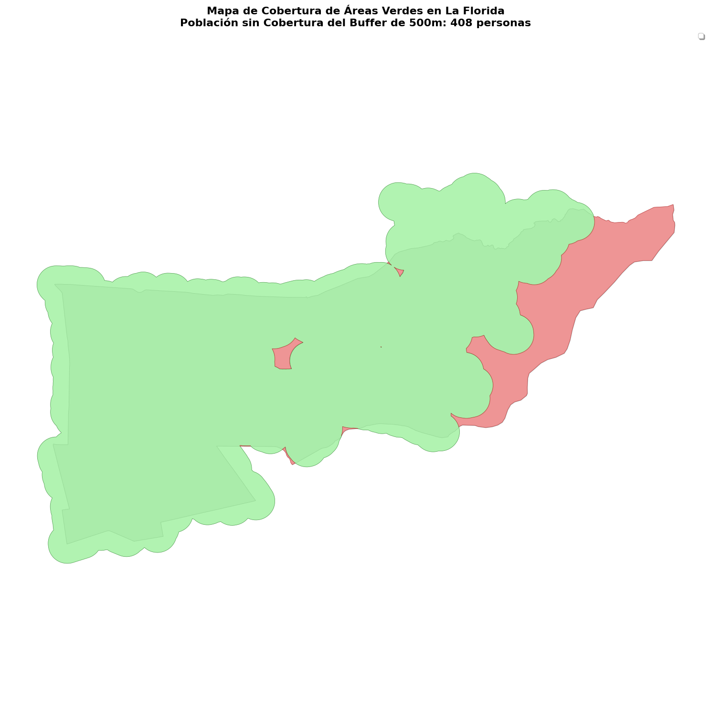

# Operaciones Espaciales

**Sesión 3.2 · Día 3 · 1,5 horas · Modalidad Meet · Docente: Denis
Berroeta (UAI)**

## Resumen ejecutivo {.unnumbered}

La sesión anterior te dejó con capas de datos de tu comuna. Esta sesión
te entrega lo que falta para que esas capas **respondan preguntas**:
las **operaciones espaciales** —medir distancias y superficies, crear
zonas de influencia (buffers), cruzar capas para saber qué cae dentro
de qué— y la noción mínima indispensable de **sistemas de coordenadas y
proyecciones**, la causa número uno de errores en análisis territorial:
capas que no calzan, distancias en unidades absurdas, mapas
desplazados.

La promesa es concreta: al terminar habrás respondido con datos una
pregunta del tipo *"¿cuántas personas viven a más de 500 metros de un
área verde en mi comuna?"* — exactamente la clase de evidencia que un
profesional público necesita para fundamentar un proyecto, priorizar
inversión o respaldar una postulación a fondos. Todo mediante vibe
coding: la IA ejecuta las operaciones; tú aportas la pregunta, el
criterio y la validación.

El principio territorial de fondo cambia de nivel: en la 3.1 dijimos
que *todo pasa en alguna parte*; ahora agregamos que **el mapa no es el
territorio**. La escala y la proyección no son tecnicismos: son
decisiones que afectan cuánto mide una plaza, qué población queda fuera
de cobertura y qué tan defendible es la cifra frente a un municipio,
una comunidad o una postulación a fondos.

Al finalizar la sesión serás capaz de:

1.  **Formular preguntas territoriales como operaciones espaciales**:
    traducir "¿qué tan lejos está X de Y?" a distancia, buffer,
    intersección y unión.
2.  **Solicitar mediante prompts las operaciones fundamentales**: áreas
    y distancias, buffers, intersección y cruce de capas, conteo dentro
    de polígonos.
3.  **Comprender funcionalmente qué es un sistema de coordenadas** y las
    dos "familias" que importan: geográficas (grados, para ubicar) y
    proyectadas (metros, para medir).
4.  **Diagnosticar los síntomas clásicos de errores de proyección** y
    pedir la corrección (para Chile central: EPSG:32719 / UTM 19S).
5.  **Aplicar la regla de oro**: *para medir, siempre en metros; para
    publicar en mapas web, en geográficas*.
6.  **Producir un análisis de accesibilidad o cobertura completo** de tu
    comuna, integrando capas de distintas fuentes.
7.  **Declarar los supuestos y limitaciones** de una cifra sensible,
    diferenciando un ejercicio pedagógico de una cifra oficial.

## Contenidos de la sesión {.unnumbered}

-   Las preguntas del territorio como operaciones espaciales: medir,
    buffer, intersección, conteo espacial.
-   Dinámica inicial: traducir preguntas reales de los proyectos a
    operaciones.
-   Coordenadas y proyecciones: lo mínimo que evita desastres.
-   EPSG:4326 vs. EPSG:32719: cuándo usar cada uno.
-   Taller: análisis de cobertura de áreas verdes de mi comuna.
-   Lectura responsable de cifras de descobertura.
-   Síntesis del Módulo 1 y proyección al Módulo 2.

## Las preguntas del territorio son operaciones espaciales

### Para despertar: qué quieren saber de su territorio

La sesión parte con una pregunta en el chat:

> *"¿Dónde falta X?", "¿quiénes quedan lejos de Y?", "¿cuánto Z hay
> dentro de W?"*

Cada equipo escribe una pregunta real de su proyecto con ese formato.
No buscamos todavía el dato perfecto ni el mapa final: buscamos detectar
qué operación espacial está escondida detrás de la pregunta. Si se
puede dibujar, casi siempre se puede calcular.

Casi todas las preguntas reales de gestión territorial —"¿dónde falta
X?", "¿quiénes están lejos de Y?"— se descomponen en cuatro
operaciones:

| Operación | Qué responde | Ejemplo municipal | Frase de prompt típica |
|----|----|----|----|
| **Medir** | Longitud, superficie, distancia | ¿Cuántas hectáreas de áreas verdes hay? | *"Calcula la superficie total en hectáreas"* |
| **Buffer** | Zona de influencia: "a 500 m de..." | ¿Qué sector queda a 500 m de cada consultorio? | *"Crea un buffer de 500 metros alrededor de cada punto"* |
| **Intersección / cruce** | Qué parte de A está dentro de B | ¿Qué porcentaje de la zona inundable es residencial? | *"Intersecta la capa A con la capa B y calcula el área resultante"* |
| **Conteo / join espacial** | Cuántos puntos caen en cada polígono | ¿Cuántos reclamos hay por barrio? | *"Cuenta cuántos puntos caen dentro de cada polígono y agrega la columna"* |

{fig-align="center"}

::: {.callout-tip title="Analogía: las preguntas del vecino"}
Estas operaciones son las preguntas que cualquier vecino hace sin saber
que hace geometría: "¿me queda cerca el consultorio?" (distancia),
"¿a cuánta gente le sirve esta plaza?" (buffer + conteo), "¿mi casa
está en la zona de riesgo?" (intersección). El análisis espacial es
sentido común territorial, formalizado.
:::

### El buffer ya lo conocen

Un buffer no es una abstracción rara. Cuando una pizzería dice
"repartimos hasta 2 km a la redonda", está dibujando un buffer. La
pregunta municipal "¿a cuántos vecinos les llega el punto limpio?" es
la misma operación: dibujar la zona de cobertura y contar quién queda
adentro.

También tiene una versión histórica: los barrios antiguos llegaban
hasta donde se oía la campana de la iglesia. Era un buffer acústico,
solo que nadie lo llamaba así.

## Coordenadas y proyecciones: lo mínimo que evita desastres

### El problema antes que la teoría

La demostración de la sesión: dos capas reales de la misma comuna que
**no calzan en el mapa**, y un cálculo de superficie que da un número
ridículo: "La superficie de La Florida me dio 0,0000019 unidades y las
áreas verdes aparecen en el mar". ¿Qué pasó? Las capas estaban en
sistemas de coordenadas distintos.

<!-- ::: {.callout-note appearance="simple" icon="false"} -->
<!-- 📷 **IMAGEN PENDIENTE**: Captura del "desastre": dos capas de la misma -->
<!-- comuna visiblemente desplazadas entre sí en el mapa, junto a una tabla -->
<!-- con una superficie absurda (ej. "área de la comuna: 0,0021"). Al lado, -->
<!-- la versión corregida tras reproyectar, con las capas calzando. -->
<!-- ::: -->

::: {.callout-warning title="Marte, 1999: el costo de mezclar unidades"}
La Mars Climate Orbiter de la NASA se perdió porque un equipo trabajó
con unidades imperiales y otro con unidades métricas. Nadie se equivocó
"en la física"; se equivocaron en el sistema de referencia. Cuando tu
mapa dice que una plaza mide `0,000004` unidades, estás viendo la misma
clase de problema. La diferencia es que aquí se corrige con un prompt.
:::

### La Tierra es curva, el mapa es plano

::: {.callout-tip title="Analogía: la naranja aplastada"}
Intenta aplanar la cáscara de una naranja sobre la mesa: se rompe, se
estira, se deforma. Eso le pasa a la Tierra cada vez que la dibujamos
plana. Toda representación plana distorsiona algo, y por eso existen
distintos sistemas de proyección: cada uno elige qué deformar y qué
preservar [@Tobler_1970].
:::

{fig-align="center"}

En un mapa escolar, Groenlandia puede parecer del tamaño de África,
aunque África es alrededor de 14 veces más grande. La pregunta
profesional no es "¿qué mapa es el verdadero?", sino "¿en qué me está
mintiendo este mapa, y me importa para esta decisión?".

::: {.callout-tip title="Principio territorial Nº 3"}
**El mapa no es el territorio.** Toda medición depende de cómo
aplanamos el mundo. La escala y la proyección son decisiones, no
tecnicismos; quien decide sin saberlo puede medir mal sin enterarse.
:::

### Lo único que hay que memorizar

{fig-align="center" width="600"}

| Sistema | Unidad | Sirve para | No sirve para |
|----|----|----|----|
| **Geográficas (EPSG:4326)** | Grados de latitud/longitud | Ubicar, compartir, mapas web | **Medir** |
| **Proyectadas UTM 19S (EPSG:32719)** | Metros | **Medir cualquier cosa en Chile central** | — |

**Síntoma → acción**: capas desplazadas o números absurdos →

> *"Reproyecta todas las capas a EPSG:32719 antes de calcular."*

::: callout-important
**Regla de oro del curso**: para **medir**, siempre en metros
(EPSG:32719); para **publicar** en mapas web, en geográficas
(EPSG:4326). No necesitas entender la matemática: necesitas reconocer
el síntoma y pedir la corrección.
:::

### Diagnóstico express

| Síntoma | Prompt de corrección |
|----|----|
| Las capas no se superponen o el mapa sale desplazado | *"Reproyecta todas las capas a EPSG:32719 antes de cruzarlas."* |
| Áreas o distancias absurdas: `0,000004`, `0,0000019` o miles de millones | *"Reproyecta todas las capas a EPSG:32719 antes de calcular áreas, distancias o buffers."* |
| El resultado parece plausible, pero necesitas defenderlo | *"Compara la superficie calculada con la superficie oficial de la comuna según BCN o SUBDERE."* |

La verificación en vivo cierra el ciclo: se le pide a la IA diagnosticar
y corregir el problema inicial, y el resultado se valida contra una
medida conocida, como la superficie oficial de la comuna.

### Chile: el país difícil de aplanar

Chile cruza miles de kilómetros de norte a sur y varios husos UTM. Es
uno de los países donde elegir mal la proyección puede distorsionar más
rápido las mediciones. La buena noticia pedagógica es que si aprendes a
revisar proyecciones aquí, el criterio te sirve en cualquier parte.

## Actividades

### Taller: análisis de cobertura de mi comuna (35 min)

Caso modelado con La Florida y replicado por cada equipo con su comuna y
su equipamiento de interés. Secuencia de prompts:

1.  > *"Carga el límite comunal y las áreas verdes (de la sesión
    > anterior) y reproyecta todo a EPSG:32719."*
2.  > *"Crea un buffer de 500 metros alrededor de cada área verde y
    > muéstralo en el mapa."*
3.  > *"Une todos los buffers y calcula qué porcentaje de la superficie
    > comunal queda cubierto."*
4.  > *"Carga las manzanas censales con población y calcula cuánta
    > población queda FUERA de la cobertura."*
5.  > *"Haz un mapa final: zonas cubiertas en verde, zonas descubiertas
    > en rojo, con un título y la cifra de población sin cobertura."*

Cada paso incluye una micro-validación: ¿el porcentaje es plausible?,
¿el mapa calza con lo que tú sabes de tu comuna?

Prompt compacto para equipos:

> *"Crea un buffer de 500 metros alrededor de cada [equipamiento] de
> [TU COMUNA], une los buffers y dime qué porcentaje de la superficie y
> cuánta población queda fuera."*

La capa censal del INE viene pre-procesada por comuna para que el foco
esté en la operación espacial y no en resolver descargas durante el
taller. Si el paso censal se traba, se revisa en pantalla y queda como
tarea guiada.

{fig-aling="center}

<!-- ::: {.callout-note appearance="simple" icon="false"} -->
<!-- 📷 **IMAGEN PENDIENTE**: El mapa final del taller para La Florida: zonas -->
<!-- cubiertas por buffers de áreas verdes en verde, zonas descubiertas en -->
<!-- rojo, título y cifra destacada de población sin cobertura. Es el -->
<!-- "diploma emocional" del Módulo 1 y debe verse presentable, digno de una -->
<!-- minuta para el alcalde. -->
:::

::: callout-warning
**Resultado sensible**: la cifra de población "fuera de cobertura" es
un ejercicio pedagógico, no una cifra oficial. Depende de la calidad
del dato OSM y del supuesto de distancia euclidiana (línea recta) en
vez de caminable. Declarar estas limitaciones es un hábito profesional,
no una debilidad.
:::

### Antes de mostrar esa cifra

Una cifra de población "fuera de cobertura" no es solo un resultado
metodológico: en municipios, gobiernos regionales y servicios públicos
también es un punto político. Puede orientar prioridades, abrir una
discusión presupuestaria o respaldar una postulación. Por eso hay que
declarar el método antes de usarla fuera del taller:

-   Fuente de equipamientos: OpenStreetMap u otra capa oficial.
-   Distancia usada: línea recta o red caminable.
-   Proyección usada para medir: EPSG:32719 en Chile central.
-   Capa poblacional: manzanas o zonas censales del INE.
-   Validación: comparación con cifras oficiales o conocimiento local.

Declarar supuestos no debilita la evidencia; la hace defendible.

### Para qué sirve esta cifra

El buffer es geometría, pero la pregunta es de justicia territorial:
¿quién queda cerca de un servicio y quién queda sistemáticamente lejos?
La referencia habitual para áreas verdes y equipamientos de proximidad
se expresa como distancia caminable del hogar, del orden de 300 a 500
metros según estándar y contexto.

El mismo flujo sirve para áreas verdes, consultorios, puntos limpios,
paraderos o ferias. Cambia la capa; no cambia el método. En la práctica
puede fundamentar priorización de paradas, decisiones de transporte con
enfoque de género, inversión comunal o proyectos de sostenibilidad.

### Checklist de autodiagnóstico del Módulo 1

Cierre con autoevaluación rápida en 5 preguntas:

1.  ¿Puedo escribir un prompt con contexto, datos, resultado esperado y
    restricciones?
2.  ¿Puedo traer el límite y los equipamientos de mi comuna con una
    frase?
3.  ¿Sé qué operación responde mi pregunta: medir, buffer, intersectar o
    contar?
4.  ¿Sé qué hacer cuando las capas no calzan o los números salen
    absurdos?
5.  ¿Validé mi cifra contra algo que ya conocía?

### Tarea puente al Módulo 2

Repite el análisis con el equipamiento central de la problemática de tu
equipo y lleva el mapa a la sesión 4.1. Guarda también los prompts: la
hoja de ruta final se construye sobre ellos.

## Resumen

-   Casi toda pregunta territorial se descompone en cuatro operaciones:
    **medir, buffer, intersección y conteo espacial**. Formular bien la
    pregunta es traducirla a estas operaciones.
-   La Tierra es curva y el mapa es plano: por eso existen los sistemas
    de coordenadas. Dos familias bastan: **EPSG:4326** (grados, para
    ubicar y publicar) y **EPSG:32719** (metros, para medir en Chile
    central).
-   Síntoma de error de proyección (capas desplazadas, cifras absurdas)
    → prompt de corrección: *"reproyecta todo a EPSG:32719 antes de
    calcular"*.
-   El mapa no es el territorio: toda cifra espacial depende de escala,
    proyección, fuente de datos y método de medición. Declarar esos
    supuestos hace que la evidencia sea defendible.
-   El arco del Módulo 1 quedó completo: **prompting (2.1) → vibe coding
    (2.2) → datos del territorio (3.1) → análisis espacial (3.2)**. Ya
    tienes el flujo: pregunta → datos → análisis → mapa con evidencia.
-   Lo que viene en el Módulo 2: hasta ahora usamos datos que ya
    existían; lo siguiente es **crear datos nuevos con la ciudadanía**,
    completar mapas donde falten datos y procesar lo que la gente dice y
    siente.

## Recursos

-   **Notebook Colab "Cobertura comunal"**: continúa el de la sesión
    3.1, con la secuencia completa del taller y celdas de validación.
-   **Capa censal pre-procesada** (manzanas/zonas censales con
    población, Censo INE) para las comunas de los participantes.
-   **Ficha "Coordenadas sin lágrimas" (1 página)**: geográficas vs.
    proyectadas, EPSG:4326 vs. EPSG:32719, tabla síntoma → prompt de
    corrección.
-   **Prompt-book de la sesión**: la secuencia de 5 prompts del taller +
    variantes (otras distancias de buffer, otros equipamientos,
    comparación entre comunas).
-   **Checklist de cierre del Módulo 1** (autoevaluación de 5 puntos).
-   Referencia breve sobre estándares de accesibilidad a áreas verdes
    (recomendación OMS y estándares MINVU) para dar contexto normativo a
    la cifra producida.
