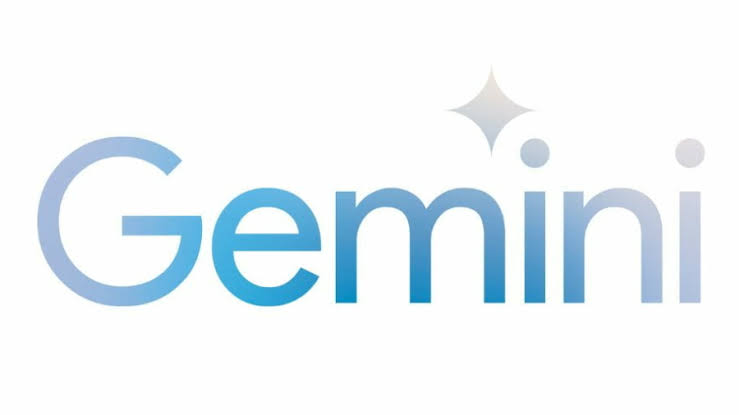

# Google

## Resumen ejecutivo {.unnumbered}

 ofrece uno de los ecosistemas de IA gratuitos más completos
disponibles hoy
para un funcionario público: un asistente conversacional de primera
línea (), un laboratorio para usar los modelos sin
restricciones de interfaz (), generación y edición de
imágenes con IA, una herramienta de línea de comandos open source con
cuota gratuita generosa () y un entorno para ejecutar
análisis sin instalar nada (). Es además el
ecosistema central del curso: los créditos de  del programa
amplían todo lo anterior. [Modelos de Google - Visitado 07-07-2026](https://docs.cloud.google.com/gemini-enterprise-agent-platform/models/google-models?hl=es-419)

## Gemini (app y web)

{fig-align="center" width="300"}

**Acceso:**  · Gratuito
con cuenta Google; nivel de pago para uso intensivo.

El asistente conversacional de Google. Los dos modelos que importan:

| Modelo | Cuándo usarlo |
|----|----|
| **** | Tareas acotadas, respuestas rápidas, iteración ágil: la mayoría de los casos |
| **** | Razonamiento complejo, documentos extensos, análisis con muchas condiciones |

Su ventaja diferencial para el sector público chileno es la
**integración nativa con **: lee archivos de Drive,
analiza Sheets, resume Docs y redacta en Gmail directamente. Si tu
municipio ya trabaja sobre , Gemini opera dentro de los
documentos que ya tienes, sin exportar nada.

::: {.callout-tip title="Ejemplos de uso municipal"}
-   *"Lee esta planilla de reclamos de Drive y dime qué tipo de
    reclamo creció más en los últimos tres meses, por sector."*
-   *"Resume este informe técnico de 40 páginas en una minuta de una
    página para la alcaldesa, en lenguaje no técnico."*
-   *"A partir de estas notas de la reunión de la mesa barrial, redacta
    el acta formal con acuerdos y responsables."*
:::

## Google AI Studio

**Acceso:**  ·
Gratuito.

La puerta "de laboratorio" a los mismos modelos: permite elegir el
modelo exacto, ajustar parámetros, trabajar con instrucciones de
sistema y procesar volúmenes mayores de texto que la app. Es el lugar
para convertir un prompt que funciona en una **plantilla institucional
reutilizable**: defines una vez la instrucción ("clasifica respuestas
ciudadanas en estas categorías...") y la reutilizas con cada nuevo
corpus.

::: {.callout-note appearance="simple" icon="false"}
📷 **IMAGEN PENDIENTE**: Captura de Google AI Studio con una
conversación de análisis de documento municipal, destacando la barra
lateral de selección de modelo (Flash / Pro) y el campo de
instrucciones de sistema.
:::

## Generación y edición de imágenes con IA

**Acceso:** dentro de la app Gemini y de AI Studio · Gratuito con
límites.

Gemini incluye modelos de **generación y edición de imágenes**. Más
allá de la curiosidad, tienen usos institucionales concretos: editar y
generar imágenes con instrucciones en español, manteniendo consistencia
entre versiones.

::: {.callout-tip title="Ejemplos de uso municipal"}
-   **Visualizar intervenciones antes de ejecutarlas**: subir la foto de
    una esquina y pedir *"muestra esta misma esquina con un paso
    peatonal pintado, maceteros y una banca"* — el render barato del
    urbanismo táctico, para conversar con vecinos sobre algo visible.
-   **Material gráfico de difusión**: afiches e ilustraciones para
    convocatorias de talleres participativos sin contratar diseño.
-   **Limpieza de material fotográfico**: quitar elementos que
    distraen de una foto de terreno para una presentación.
:::

::: callout-warning
Una imagen generada por IA en comunicación institucional **se declara
como tal**. Y nunca generes imágenes de personas reales identificables.
:::

## Gemini CLI: open source en el terminal

**Acceso:** 
· **Open source (Apache 2.0)** · Cuota gratuita generosa con cuenta
Google personal.

Herramienta de línea de comandos: la misma lógica de vibe coding del
curso, pero desde el terminal del computador. Para el perfil del curso
es material avanzado, pero importa por tres razones:

1.  Es **open source**: el equipo informático municipal puede
    auditarla, fijar la versión e integrarla a procesos internos.
2.  Su **cuota gratuita** permite automatizar tareas repetitivas
    (clasificar archivos, generar resúmenes periódicos) sin costo.
3.  Trabaja **sobre carpetas locales**: puede leer y procesar los
    archivos de un proyecto completo de una vez.

::: {.callout-tip title="Ejemplo de uso (perfil técnico municipal)"}
> *"Lee todos los PDF de la carpeta `actas_2025/` y genera una tabla
> CSV con fecha, organización solicitante y materia de cada acta."*

Una tarea de días de digitación, en minutos, dentro del computador
institucional.
:::

## Google Colab

**Acceso:** 
· Gratuito.

El entorno donde corren los notebooks del curso: Python en el
navegador, sin instalar nada. Fuera del curso, es la vía de costo cero
para que un equipo municipal ejecute y conserve los análisis espaciales
del Módulo 1 como documentos reutilizables y compartibles.

## Ficha rápida

| Herramienta | Para qué | Costo |
|----|----|----|
| Gemini (app) | Asistente general + Workspace | Gratuito |
| AI Studio | Plantillas y procesamiento avanzado | Gratuito |
| Imágenes con IA | Generación/edición de imágenes | Gratuito con límites |
| Gemini CLI | Automatización en terminal | Gratuito, open source |
| Colab | Notebooks Python sin instalación | Gratuito |

## Limitaciones

-   Los límites del nivel gratuito cambian con frecuencia; verificar
    antes de planificar un flujo crítico.
-   Datos enviados a la nube de Google: aplicar los principios de uso
    responsable de esta parte (anonimizar; lo sensible no sale de la
    institución).
-   La integración Workspace requiere que la institución use
    ; con Microsoft 365 el equivalente es
    Copilot (no cubierto aquí).
