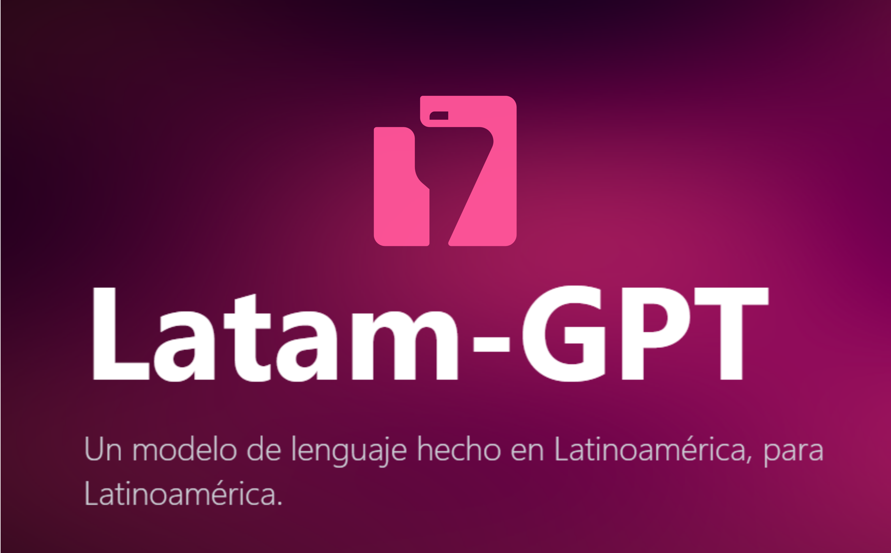

# LatamGPT

## Resumen ejecutivo {.unnumbered}

 es el proyecto de modelo de lenguaje **abierto y
latinoamericano** liderado desde Chile por el  (Centro
Nacional de Inteligencia Artificial), con colaboración de instituciones
de toda la región. Su apuesta es doble: un modelo **entrenado con datos
de América Latina** —su español, sus instituciones, sus contextos— y un
modelo **abierto**, que universidades, estados y municipios pueden usar
y desplegar sin depender de la voluntad comercial de una empresa
extranjera. Para el sector público chileno no es solo una herramienta:
es la pieza de **soberanía tecnológica** del mapa de esta parte.

{fig-align="center" width="500"}

**Acceso:**  · Modelo abierto;
verificar canales de acceso vigentes (demo web, descarga de pesos,
despliegue institucional).

## Por qué importa un modelo regional

Los modelos globales se entrenan predominantemente con contenido en
inglés y de contexto anglosajón. Las consecuencias prácticas para un
funcionario chileno:

-   Conocen menos la **institucionalidad local**: SUBDERE, SEREMI,
    SECPLA, DIDECO, el sistema municipal chileno.
-   Su español tiende al neutro o peninsular; matices chilenos y
    regionales se pierden.
-   Los ejemplos y referencias que proponen vienen de otros contextos
    normativos y urbanos.

Un modelo entrenado con corpus latinoamericano invierte esa relación:
el contexto regional no es la excepción que hay que explicar en el
prompt, sino el terreno nativo del modelo.

](images/inst_cenia.jpg){fig-align="center" width="400"}

::: {.callout-tip title="Ejemplos de uso municipal"}
-   *"Explica qué instrumentos de planificación territorial chilenos
    (PLADECO, PRC, PROT) corresponden a cada escala de decisión y cómo
    se relacionan."*
-   *"Redacta la fundamentación de un proyecto de recuperación de
    espacio público usando terminología del sistema público chileno."*
-   *"¿Qué experiencias latinoamericanas de presupuesto participativo
    son comparables con una comuna de 100.000 habitantes?"*
:::

## La dimensión de soberanía

Por ser un modelo abierto,  habilita lo que los servicios
comerciales en la nube no pueden ofrecer:

1.  **Despliegue en infraestructura propia**: un servicio público puede
    ejecutarlo en sus servidores; los datos no salen de la institución
    (mismo argumento de los modelos locales, con la ventaja del contexto
    regional).
2.  **Auditabilidad**: saber con qué datos y criterios fue construido,
    condición cada vez más relevante para el uso estatal de IA.
3.  **Continuidad**: no desaparece ni cambia de precio por decisión
    comercial de un tercero.
4.  **Ecosistema regional**: usarlo y reportar errores fortalece una
    capacidad pública latinoamericana en IA.

::: callout-warning
**Expectativas honestas**: un modelo regional abierto no compite hoy en
capacidad bruta con los modelos frontera (,
, ). La
elección es de criterio: para razonamiento complejo, modelos frontera;
para contexto regional, datos sensibles o independencia tecnológica, el
modelo abierto regional. No es uno u otro: es saber cuándo cada cual.
:::

<!-- {fig-align="center" width="500"} -->

## Ficha rápida

| Aspecto | Detalle |
|----|----|
| Costo | Abierto / gratuito |
| Quién está detrás |  (Chile) + red de instituciones latinoamericanas |
| Fortaleza | Contexto latinoamericano nativo; apertura y soberanía |
| Mejor para | Texto con contexto chileno/regional; despliegues institucionales |
| Limitación | Menor capacidad bruta que modelos frontera; canales de acceso en evolución |
| Verificar | Estado actual del proyecto y formas de acceso en latamgpt.org |
