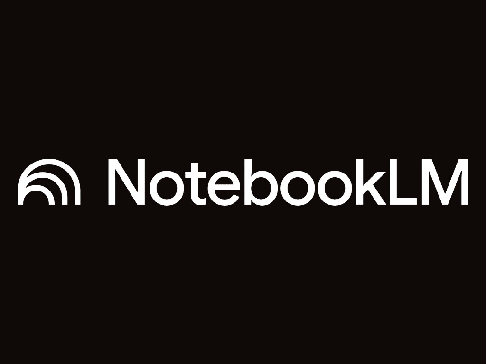

# NotebookLM

## Resumen ejecutivo {.unnumbered}

 es probablemente la herramienta más valiosa de esta
parte para el perfil del curso, y es gratuita. Funciona así: subes tus
fuentes (PDF, Google Docs, páginas web, videos de YouTube, audios) y
luego **conversas con ese conjunto de documentos** como si fuera un
experto que los hubiera leído todos. Toda respuesta incluye cita del
documento fuente. Lo que la distingue de un asistente convencional es
que **no inventa**: solo responde con información que está en los
documentos que subiste, y señala exactamente de dónde viene cada
afirmación.

{fig-align="center" width="400"}

**Acceso:**  ·
Gratuito con cuenta Google.

## Cómo funciona

1.  **Crear un notebook** por tema o proyecto (ej.: "Actualización
    PLADECO 2026").
2.  **Subir las fuentes**: hasta decenas de documentos por notebook —
    PDFs, Docs, enlaces, transcripciones, audios de reuniones.
3.  **Preguntar en español**: cada respuesta llega con citas numeradas
    que enlazan al pasaje exacto del documento original.
4.  **Generar productos**: resúmenes estructurados, guías de estudio,
    preguntas frecuentes, e incluso un **resumen en audio** estilo
    conversación (útil para socializar un diagnóstico con el equipo).

::: {.callout-note appearance="simple" icon="false"}
📷 **IMAGEN PENDIENTE**: Captura de NotebookLM con un notebook abierto:
panel izquierdo con fuentes cargadas (PDFs municipales reconocibles:
PLADECO, ordenanza, actas), panel central con una respuesta que muestra
sus citas numeradas, y panel derecho con las opciones de generación
(resumen, audio, FAQ).
:::

## Casos de uso municipales

::: {.callout-tip title="Sistematizar participación ciudadana"}
> Sube las actas de 8 talleres participativos del proceso de
> actualización del PLADECO y pregunta: *"¿Cuáles son los cinco
> problemas territoriales más mencionados y en qué talleres
> aparecieron?"*

Cada problema citado lleva el enlace al acta y párrafo de origen:
trazabilidad lista para el informe.
:::

::: {.callout-tip title="Análisis normativo"}
> Sube el Plan Regulador Comunal, la Ordenanza Local y el Plan de
> Gestión de Residuos y pregunta: *"¿Qué restricciones de uso de suelo
> existen para instalar un punto limpio en zonas residenciales?"*

Respuesta con artículos citados, verificable antes de responder un
oficio.
:::

::: {.callout-tip title="Memoria institucional"}
> Sube los informes finales de los últimos 5 programas de recuperación
> de espacios públicos y pregunta: *"¿Qué problemas de ejecución se
> repiten entre programas y qué soluciones se aplicaron?"*

El conocimiento que se va con cada rotación de personal, recuperado en
minutos.
:::

::: {.callout-tip title="Preparación de postulaciones a fondos"}
> Sube las bases del fondo, tu diagnóstico territorial y dos proyectos
> ganadores anteriores y pregunta: *"¿Qué requisitos de las bases no
> están cubiertos aún por nuestro borrador?"*
:::

## Por qué importa la trazabilidad

En el sector público, una afirmación sin fuente es un riesgo: puede
terminar en un informe oficial, un oficio o una respuesta por
transparencia.  invierte la lógica del chatbot: en vez de
"confía en mí", cada frase dice "esto está en la página 14 del
documento que tú me diste". Eso lo hace apto para trabajo institucional
de una forma que los asistentes generales no logran.

::: {.callout-warning title="Límite importante"}
 trabaja **solo con lo que le subiste**. Si la respuesta no
está en esos documentos, lo dirá. Es una limitación que es también una
garantía. Corolario: la calidad de las respuestas depende de la calidad
y completitud del corpus que armes.
:::

## Ficha rápida

| Aspecto | Detalle |
|----|----|
| Costo | Gratuito (cuenta Google) |
| Instalación | Ninguna (navegador) |
| Fortaleza | Trazabilidad: toda respuesta cita su fuente |
| Mejor para | Sistematizar múltiples documentos institucionales |
| Riesgo principal | Subir documentos con datos personales sin anonimizar |
| Alternativa si el dato es sensible | Modelo local vía  /  |
