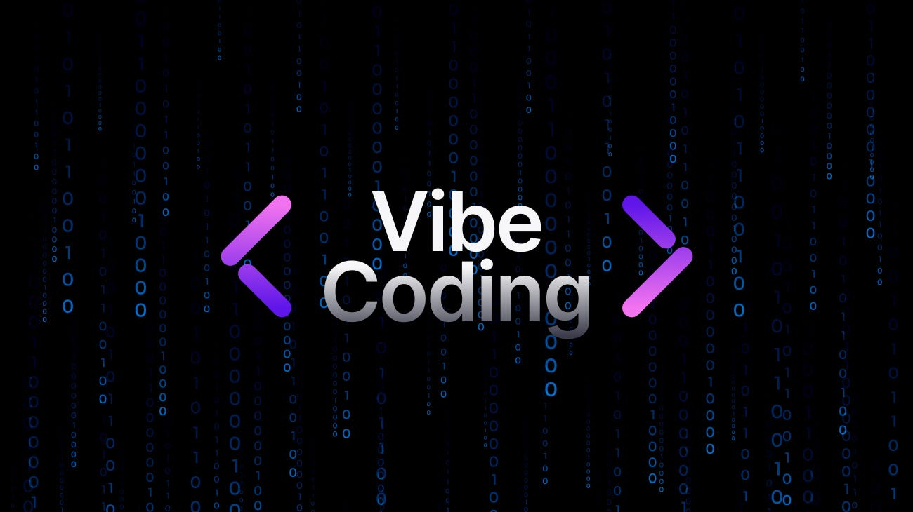
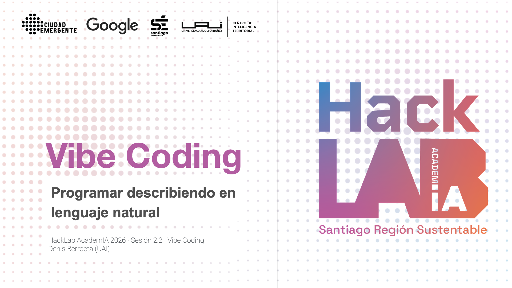
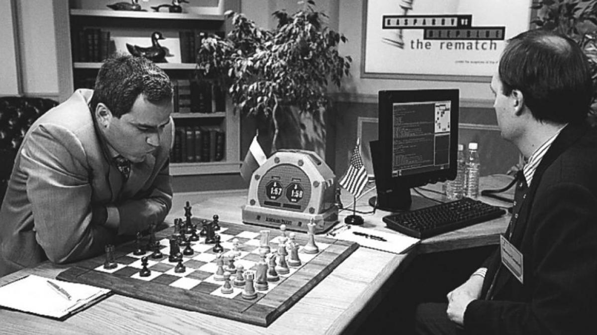
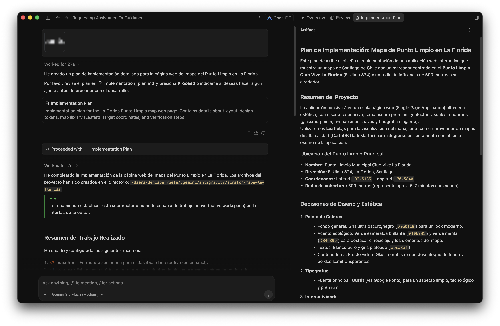
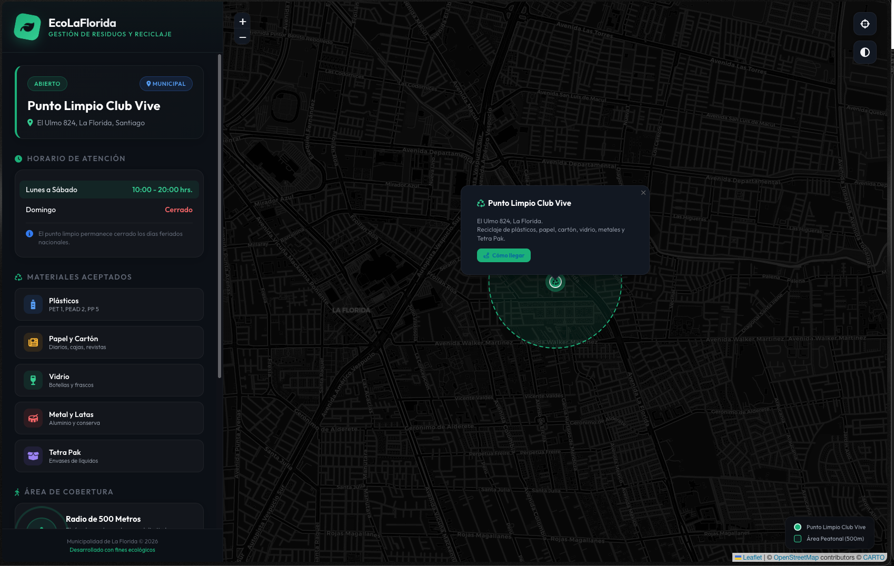
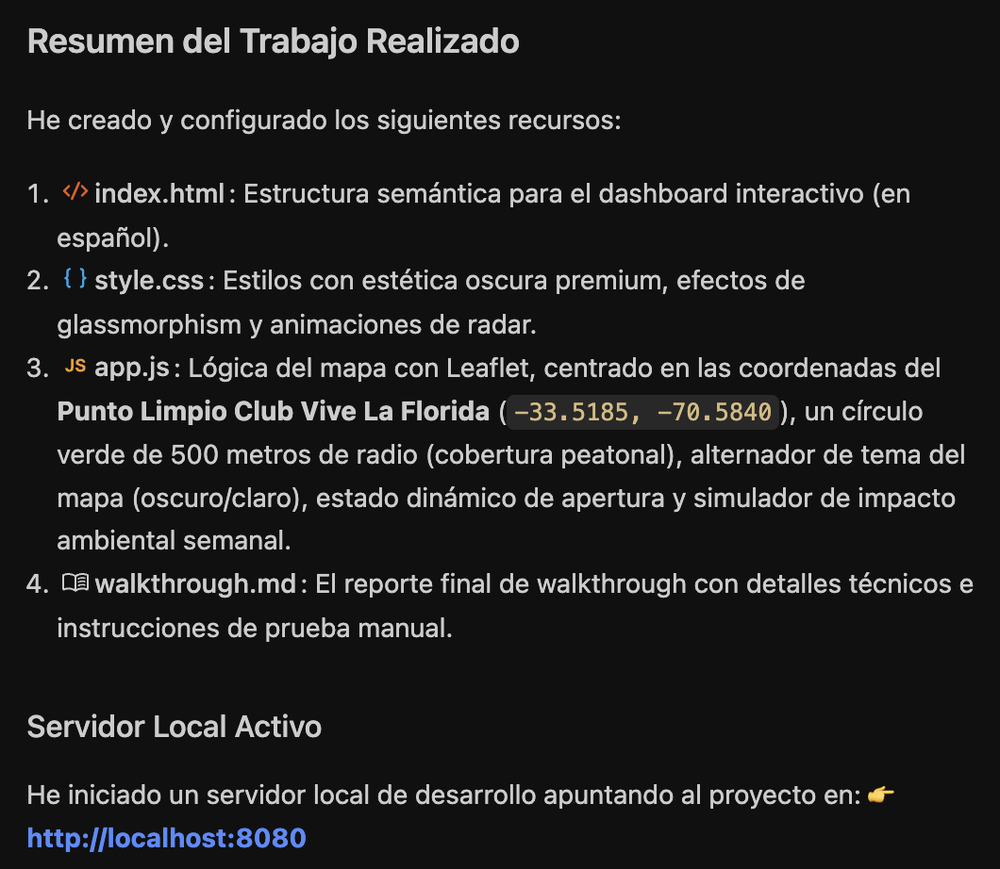
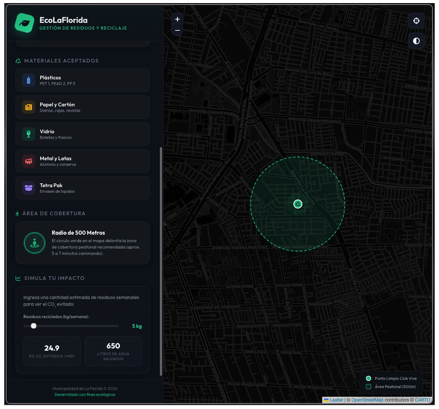
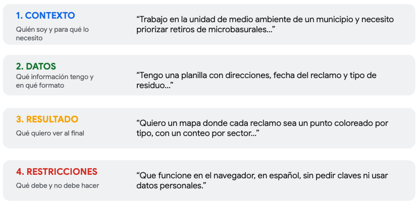

# Vibe Coding

**Sesión 2.2 · Día 2 · 1,5 horas · Modalidad Meet · Docentes: Denis
Berroeta (UAI) + Pedro Mancilla**

## Resumen ejecutivo {.unnumbered}

<!-- {fig-align="center" width="850"} -->
{fig-align="center" width="850"}

Hasta hace muy poco, convertir una idea de análisis territorial en una
herramienta funcional exigía saber programar o contratar a alguien que
supiera. Esa barrera se está moviendo. El *vibe coding*, entendido como
generar código mediante descripciones en lenguaje natural
[@karpathy_vibe_2025], permite que una persona que conoce profundamente
un problema público pueda construir un primer prototipo conversando con
una IA en español.

La sesión trabaja una idea central: el teclado dejó de ser la principal
barrera. La nueva barrera es saber **qué pedir, qué contexto entregar,
cómo evaluar lo que aparece en pantalla y cuándo desconfiar**. En el
marco del nuevo ciclo de vida del desarrollo de software, esta transición
se describe como un paso desde la sintaxis hacia la intención: la IA
puede implementar, pero la persona sigue aportando intención, contexto,
criterio y verificación [@osmani_new_sdlc_2026].

Esta sesión es la **piedra angular metodológica de todo el curso**:
todas las sesiones posteriores (Python espacial, NLP, análisis de
sentimientos e integración de datos) asumen que dominas el ciclo básico
de trabajo: *prompt → código → ejecución → evaluación → nuevo prompt*. No
se trata de aprender a programar por una vía alternativa; se trata de
asumir un rol nuevo: el de **director técnico de una IA que programa**.

Al finalizar la sesión serás capaz de:

1.  **Explicar** qué es el vibe coding y por qué cambia quién puede
    construir soluciones digitales en una organización pública.
2.  **Operar** el ciclo iterativo fundamental: *prompt → código →
    ejecución → evaluación → nuevo prompt*.
3.  **Usar Antigravity (IDE)**, seleccionando entre Gemini Flash y
    Gemini Pro según la naturaleza de la tarea.
4.  **Redactar prompts efectivos para generar código**, incluyendo
    contexto, datos, resultado esperado y restricciones.
5.  **Evaluar resultados sin leer el código línea a línea**, usando
    casos conocidos, revisión visual y contraste con los datos.
6.  **Reconocer los límites** del vibe coding: cuándo sirve para
    prototipar, cuándo requiere revisión y cuándo exige verificación
    sistemática.

## Contenidos de la sesión {.unnumbered}

Presentación: [Google Slides: 2.2 Vibe Coding](https://docs.google.com/presentation/d/1mcsFB1hi_nkagV-bx1nRUdiph_QtwDMCWa54UJ6ZR2M/edit?slide=id.p#slide=id.p)

-   El cambio de paradigma: de "saber programar" a "saber pedir".
-   Qué es un agente: percibir, planificar, actuar, observar e iterar.
-   Antigravity y los modelos Gemini (Flash / Pro).
-   El ciclo iterativo: prompt → código → resultado → mejora.
-   La plantilla de prompt del curso: contexto, datos, resultado,
    restricciones.
-   Manejo de errores sin pánico.
-   Límites, criterio, alucinaciones y verificación proporcional al
    riesgo.
-   Primer prompt del proyecto final del equipo.

## Hoja de ruta de la sesión

| Bloque | Duración | Foco | Producto esperado |
|---|---:|---|---|
| 1 | 20 min | Cambio de paradigma | Entender qué cambia cuando se programa desde la intención |
| 2 | 25 min | Antigravity y Gemini | Reproducir una demo simple con la propia comuna |
| 3 | 30 min | Ciclo iterativo | Construir y refinar una visualización en 3 iteraciones |
| 4 | 15 min | Límites y proyecto | Escribir el primer prompt del proyecto real |

La regla de la sesión es simple: nadie necesita haber programado antes.
Lo que sí se necesita es observar, describir, corregir y decidir.

## El cambio de paradigma

### De "saber programar" a "saber pedir"

Durante décadas, la programación funcionó como un idioma extranjero con
traductores escasos y caros: si un municipio necesitaba un mapa
interactivo de sus puntos limpios, debía encontrar a alguien que
"hablara código". El vibe coding invierte esa relación: ahora la máquina
puede traducir una intención escrita en lenguaje natural a código
ejecutable.

{fig-align="center" width="250"}

En febrero de 2025, Andrej Karpathy describió esta práctica como una
forma de programar en la que la persona se "entrega a las vibras",
describe lo que quiere, acepta lo que la IA produce y, cuando algo falla,
pega el error para que la IA lo corrija [@karpathy_vibe_2025]. La frase
se volvió popular porque nombró algo que ya estaba ocurriendo: muchas
personas estaban dejando de escribir cada línea de código y empezando a
dirigir sistemas que escriben código.

El cambio de fondo puede resumirse así:

| Antes | Ahora |
|---|---|
| Para construir software había que escribir sintaxis exacta. | Se describe qué se necesita; la IA propone cómo implementarlo. |
| La persona que conocía el problema dependía de alguien que conocía el código. | La persona experta en el problema puede producir un primer prototipo. |
| Cada idea esperaba presupuesto, licitación o apoyo técnico escaso. | Muchas ideas pueden explorarse en minutos antes de invertir más recursos. |
| El valor estaba principalmente en escribir implementación. | El valor se desplaza hacia intención, contexto, evaluación y juicio. |

::: {.callout-tip title="Analogía: el alcalde y la plaza"}
El alcalde no construye la plaza con sus manos: define qué plaza
necesita el barrio, revisa los avances y evalúa si quedó bien
construida. El vibe coding te pone en ese rol frente al código: **tú
diriges, la IA ejecuta**. Lo que aportas no es técnica de construcción,
sino criterio sobre qué se necesita y si el resultado sirve.
:::

### Principio territorial 1: la IA no conoce tu territorio

La IA puede conocer lenguajes de programación, bibliotecas y patrones de
interfaz. Pero no conoce como tú la historia de una comuna, los puntos de
conflicto, las restricciones políticas, las zonas donde un dato suele
fallar o los nombres locales que no aparecen en los manuales.

Por eso, un prompt sin territorio produce soluciones genéricas. El
contexto local es el insumo que ningún modelo trae incorporado: dónde
duele, qué se intentó antes, qué es viable y qué resultado sería útil
para decidir. En términos del nuevo SDLC, esta es una forma práctica de
**ingeniería de contexto**: darle a la IA la información que necesitaría
una persona nueva que llega hoy al equipo para hacer bien el trabajo
[@osmani_new_sdlc_2026].

::: {.callout-note title="Idea clave"}
La IA es el ejecutor. La persona experta en el territorio sigue siendo
quien define el problema, entrega el contexto y valida si el resultado
calza con la realidad.
:::

### Una historia: el ajedrez centauro

En 1997, Deep Blue derrotó a Garry Kasparov. La lectura fácil habría
sido: la máquina reemplazó al campeón. Pero Kasparov propuso otra forma
de jugar: humano + máquina. En el llamado "ajedrez avanzado", el valor no
estaba solo en el cálculo de la computadora, sino en la persona capaz de
dirigirlo.

{fig-align="center" width="550"}

Posteriormente en 2005 — en un torneo abierto no ganan ni los grandes maestros ni las supercomputadoras solas … ganan dos aficionados con computadores corrientes y un MÉTODO superior para dirigirlos [(Referencia)](https://en.chessbase.com/post/dark-horse-zacks-wins-freestyle-che-tournament).

La lección para esta sesión es directa: no gana necesariamente quien más
programa, sino quien mejor dirige la capacidad de la máquina. En el
trabajo público, eso significa traducir conocimiento territorial en
instrucciones claras, observar el resultado y corregir el rumbo.

## ¿Qué es vibe coding?

Para este curso, **vibe coding** significa crear programas describiendo
en lenguaje natural lo que se necesita: la IA escribe el código; la
persona dirige, observa y evalúa.

El ciclo mínimo tiene cinco pasos:

1.  **Describo** lo que necesito, en español.
2.  **La IA genera** código y lo ejecuta.
3.  **Miro el resultado**: mapa, tabla, gráfico, página o error.
4.  **Pido ajustes** describiendo la diferencia entre lo obtenido y lo
    esperado.
5.  **Repito** hasta que el resultado sirva para explorar, comunicar o
    decidir.

El ciclo no reemplaza el juicio profesional. Lo desplaza hacia los puntos
donde más importa: especificar, evaluar y verificar.

### Del chat al agente

Un chatbot responde y espera. Un agente trabaja en ciclo: recibe un
objetivo, planifica pasos, actúa usando herramientas, observa el
resultado y se corrige. El whitepaper *The New SDLC with Vibe Coding*
describe este bucle como una secuencia de percepción, planificación,
acción, observación e iteración [@osmani_new_sdlc_2026].

Esto explica algo que verás en Antigravity: a veces la IA parece
"pensar", probar, fallar y reintentar sola. No está rota; está
iterando. Tu tarea no es leer cada línea que escribió, sino mirar si el
resultado cumple el objetivo y si el camino es aceptable para el nivel de
riesgo de la tarea.

## Demostración: de una frase a una herramienta

La demostración central de la sesión es obtener una herramienta
funcionando a partir de una frase en español:

> *"Crea una página web que muestre un mapa de Santiago con un marcador
> en el punto limpio de La Florida y un círculo de 500 metros a su
> alrededor. Todo en español."*

El objetivo de la demo no es mostrar un truco, sino hacer visible el
cambio: una persona que conoce el problema territorial puede producir un
primer artefacto funcional sin empezar por la sintaxis.

Después de la demo, la pregunta importante no es "¿qué código escribió?"
sino:

-   ¿El marcador quedó donde debía?
-   ¿El radio corresponde a lo solicitado?
-   ¿El texto está en español?
-   ¿El resultado sirve para explicar o decidir algo?
-   ¿Qué falta para que sea útil en mi comuna?

  <iframe
    src="html-apps/eco_laflorida.html"
    title="EcoLaFlorida: mapa interactivo de reciclaje"
    loading="lazy"
    allowfullscreen>
  </iframe>

Aplicación generada: explora el punto limpio,
su radio peatonal de cobertura y el simulador de impacto del reciclaje.

## La herramienta: Antigravity y los modelos Gemini

### Las tres zonas esenciales del IDE

Antigravity es el entorno de trabajo (IDE) del curso. De toda su
interfaz solo necesitas reconocer tres zonas:

1.  **Zona del prompt**: donde escribes lo que necesitas. Es tu lugar de
    trabajo principal.
2.  **Zona del código**: donde la IA escribe. Se mira de reojo; no se
    edita durante esta sesión.
3.  **Zona del resultado**: donde corre la herramienta. Aquí se evalúa y
    se decide.

El resto de la interfaz se ignora deliberadamente: está pensada para
programadores y tú no necesitas dominarla para lograr el objetivo de la
sesión.

{fig-align="center" width="450"}

{fig-align="center" width="450"}

{fig-align="center"}

<!-- ### Plan B permanente: Google Colab -->

<!-- Si Antigravity falla, no se instala o presenta un problema técnico, el -->
<!-- curso usará Google Colab como plan B. La lógica de trabajo es la misma: -->
<!-- describir, ejecutar, observar e iterar. La herramienta cambia; el método -->
<!-- no. -->

<!-- ### Elegir el modelo: Flash o Pro -->

<!-- | Modelo | Cuándo usarlo | -->
<!-- |---|---| -->
<!-- | **Gemini Flash** | Tareas acotadas, respuestas rápidas, iteración ágil. La mayoría de los ejercicios del curso. | -->
<!-- | **Gemini Pro** | Problemas de varios pasos, muchas condiciones, razonamiento más exigente o resultados donde Flash se queda corto. | -->

<!-- ::: {.callout-tip title="Regla práctica"} -->
<!-- Empieza siempre con **Flash**. Si el resultado se queda corto, el -->
<!-- problema tiene muchas partes o necesitas razonamiento más cuidadoso, -->
<!-- sube a **Pro**. -->
<!-- ::: -->

## La plantilla recomendada

La calidad de lo que la IA produce depende menos de palabras mágicas y
más de la calidad del contexto que recibe. La pregunta correcta no es
"¿cómo engaño a la IA para que lo haga bien?", sino "¿qué necesitaría
saber una persona nueva que llega hoy a mi equipo para hacer bien este
trabajo?".

La plantilla del curso tiene cuatro piezas:

1.  **Contexto**: quién soy, dónde trabajo y para qué necesito la
    herramienta.
2.  **Datos**: qué información tengo, en qué formato y con qué columnas
    o campos.
3.  **Resultado esperado**: qué quiero ver al final y cómo sabré que
    está bien.
4.  **Restricciones**: qué debe y no debe hacer la solución.

### Ejemplo de prompt completo

> Trabajo en la unidad de medio ambiente de un municipio y necesito
> priorizar retiros de microbasurales. Tengo una planilla con dirección,
> fecha del reclamo, tipo de residuo y comuna. Quiero un mapa donde cada
> reclamo aparezca como un punto coloreado por tipo, con un conteo por
> sector. Que funcione en el navegador, esté en español, no pida claves
> de acceso y no use datos personales.

### Prompt vago versus prompt con contexto

| Prompt vago | Prompt con contexto |
|---|---|
| "Haz un análisis de los reclamos de mi comuna." | Contexto + datos + resultado + restricciones. |
| La IA inventa supuestos para rellenar lo que no dijiste. | La IA trabaja con tu problema y tus datos. |
| El resultado puede verse profesional, pero no servir para decidir. | El resultado es más específico, evaluable y accionable. |

## Iterar es el método

El primer resultado casi nunca es el final. Y eso no es un fracaso: es
el método. Un primer resultado es un borrador de trabajo, como la primera
versión de un informe.

La habilidad central es describir en español la diferencia entre lo que
obtuviste y lo que querías:

> *"El mapa está bien, pero los puntos son muy pequeños y no se
> distinguen los tipos de reclamo. Hazlos más grandes, agrega una
> leyenda con los colores y muestra un conteo por categoría."*

Tres iteraciones bien descritas valen más que un prompt supuestamente
perfecto. Cada iteración enseña algo sobre el problema, los datos y las
limitaciones de la herramienta.

::: {.callout-tip title="Analogía: el peluquero"}
Nadie le dice al peluquero "aplica la técnica de degradado con tijera de
entresacar". Le dice "más corto a los lados, arriba déjalo como está". Y
si el resultado no convence, lo corrige mirando el espejo: "un poco más
corto atrás". Con la IA es igual: describes el cambio que ves necesario,
no la técnica para lograrlo.
:::

## Cuando algo falla

Cuando algo falla, la pantalla puede mostrar texto rojo o un mensaje que
parece escrito en otro idioma. La respuesta del curso es un reflejo
simple:

1.  Copia el mensaje de error completo.
2.  Pégaselo a la IA.
3.  Pide una explicación simple y una corrección.
4.  Mira nuevamente el resultado.

Prompt de reparación:

> *"Apareció este error: [pegar mensaje completo]. Explícame en simple
> qué pasó y corrígelo sin cambiar el objetivo de la herramienta."*

El error deja de ser un muro y pasa a ser un mensaje más de la
conversación. Aun así, no todos los errores son visibles: algunos
resultados se ven correctos y están mal calculados. Por eso la siguiente
sección es tan importante.

## Límites y criterio

### El problema del 80%

La IA puede producir rápido el 80% de una solución: una interfaz que se
ve bien, un mapa que carga, una tabla ordenada, un gráfico convincente.
El 20% restante, es decir, casos raros, datos sucios, supuestos
invisibles, restricciones locales y decisiones de uso, es exactamente
donde entra el
criterio profesional.

El whitepaper de SDLC lo plantea como una diferencia entre vibe coding y
prácticas más estructuradas: para un prototipo puede bastar con que algo
parezca funcionar; para software o análisis en los que una organización
depende del resultado, se necesitan pruebas, revisión, restricciones y
supervisión humana [@osmani_new_sdlc_2026].

### No todo se "vibra": espectro de confianza

| Uso | Nivel de confianza aceptable | Verificación mínima |
|---|---|---|
| **Explorar / prototipar** | Vibe coding rápido: "parece que funciona" puede bastar. | Revisión visual y sentido común territorial. |
| **Analizar / informar** | Revisión selectiva: no basta con que se vea bien. | Validar cifras, muestras y supuestos. |
| **Decidir / publicar** | Verificación sistemática. | Contrastar datos, revisar metodología y documentar fuentes. |

La pregunta clave no es "¿usé IA?", sino "¿cómo verifiqué lo que produjo?".

### Tres reglas de verificación para no programadores

1.  **Prueba siempre con un caso cuyo resultado ya conoces.** Si sabes
    que tu comuna tiene cerca de 14 puntos limpios y el mapa muestra 3,
    algo anda mal.
2.  **Desconfía de cifras y nombres que no salieron de tus datos.** Si
    la IA cita totales, lugares o fuentes que no le entregaste, pídele el
    origen o descártalo.
3.  **Nunca uses datos personales o sensibles reales en estos
    ejercicios.** Nombres, RUT, teléfonos, direcciones exactas y casos
    identificables se quitan antes de procesar. Esta dimensión se
    profundiza en el Módulo 3.

### Alucinaciones: plausibilidad no es verdad

Una alucinación ocurre cuando la IA completa vacíos con información
plausible pero falsa. El riesgo es mayor cuando el resultado "suena" bien
o se ve profesional. En gestión pública, una cifra inventada en una
minuta, un nombre de programa inexistente o una ubicación mal asignada
pueden producir decisiones equivocadas.

La postura profesional es usar la IA para lo que hace bien: proponer,
generar, ordenar y prototipar. La atención humana se reserva para lo que
hace peor: contexto local, casos límite, verificación y responsabilidad.

## Actividades

### Ejercicio 1: tu comuna, tu primer prompt

Adapta la demostración a tu territorio:

> *"Crea una página web que muestre un mapa con un marcador en [un lugar
> importante de TU comuna] y un círculo de [500] metros a su alrededor.
> Todo en español."*

Cuando funcione, realiza una iteración: cambia el radio, el lugar, el
color del círculo o el texto visible. Una mejora concreta cuenta como
éxito.

Verifica:

-   ¿El marcador quedó realmente sobre el lugar correcto?
-   ¿El círculo tiene sentido para la escala del barrio?
-   ¿El mapa está en una zona reconocible para ti?
-   ¿Qué corregirías antes de mostrarlo a otra persona?

### Ejercicio 2: de la planilla al mapa, en 3 iteraciones

Usa el dataset del curso de puntos de interés comunales de la Región
Metropolitana (plazas, consultorios, sedes vecinales y puntos limpios).
Trabaja en equipos y produce una visualización refinada en al menos tres
iteraciones:

1.  **Iteración 1**: carga la planilla y muestra los puntos en un mapa.
2.  **Iteración 2**: mejora algo sustantivo: colores por tipo, tamaños,
    filtros por comuna o etiquetas.
3.  **Iteración 3**: hazlo presentable: título, leyenda en español,
    conteo por categoría y una lectura clara.

Usa la plantilla completa: contexto, datos, resultado y restricciones.
Guarda los prompts que funcionaron. Son capital de trabajo para la
sesión 3.1.

### Cierre: el primer prompt de tu proyecto

Cada equipo escribe, aunque todavía no lo ejecute, el primer prompt de su
problemática real:

-   **Contexto**: quiénes somos y qué problema territorial queremos
    abordar.
-   **Datos**: qué tenemos hoy, aunque sea una planilla incompleta o
    desordenada.
-   **Resultado**: qué querríamos ver en pantalla.
-   **Restricciones**: qué no debe pasar, qué datos no se pueden usar y
    qué supuestos deben respetarse.

Ese prompt es la semilla de la hoja de ruta final. En la sesión 3.1 se
retomará con datos reales del territorio.

## Resumen

-   El vibe coding cambia la pregunta de "¿quién sabe programar?" a
    "¿quién sabe qué se necesita?".
-   La IA no conoce tu territorio: tu contexto local es el insumo más
    importante.
-   El ciclo de trabajo permanente es **prompt → código → ejecución →
    evaluación → nuevo prompt**.
-   Un buen prompt incluye **contexto, datos, resultado esperado y
    restricciones**.
-   Empieza con Gemini **Flash**; sube a **Pro** cuando el problema
    tenga muchas partes o requiera razonamiento más cuidadoso.
-   Ante un error: copiar, pegar, pedir explicación y corrección.
-   No todo se "vibra": prototipar, informar y decidir requieren niveles
    distintos de verificación.
-   Generar código ya está resuelto. Dirigir, evaluar y decidir es el
    nuevo oficio.

## Recursos

-   **Guía de preparación previa**: creación de cuenta Google, activación
    de créditos, instalación de Antigravity y prueba de acceso.
-   **Plantilla de prompt del curso**: Contexto / Datos / Resultado
    esperado / Restricciones, con ejemplos territoriales.
-   **Lectura opcional**: *The New SDLC with Vibe Coding*, para
    profundizar en el paso desde vibe coding hacia ingeniería agéntica,
    verificación, contexto y nuevos roles humanos en el desarrollo de
    software [@osmani_new_sdlc_2026].
